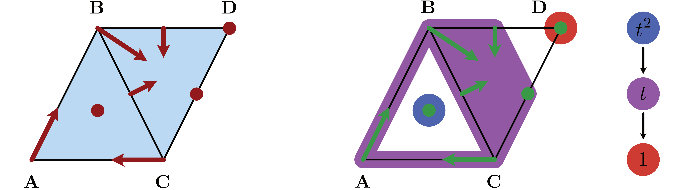
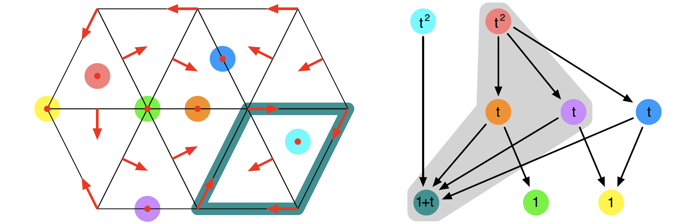
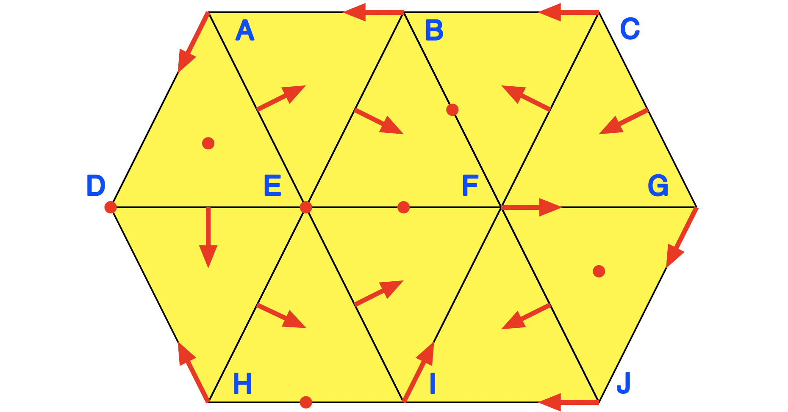

# Conley Theory

The main motivation for
[ConleyDynamics.jl](https://almost6heads.github.io/ConleyDynamics.jl)
is the development of an accessible tool for studying the global
dynamics of multivector fields on Lefschetz complexes. Having already
discussed the latter, we now turn our attention to multivector fields
and their global dynamics. This involves a detailed discussion of
multivector fields, isolated invariant sets, their Conley index,
as well as Morse decompositions and connection matrices. We also
briefly compare the different connection matrix algorithms which
are provided by the package. Finally, we address Forman's Morse
complex and the functions that can be used to work with it.

## Multivector Fields

Suppose that ``X`` is a Lefschetz complex as described in
[Lefschetz Complexes](@ref), see in particular the definition
in [Basic Lefschetz Terminology](@ref). Assume further that the
Lefschetz complex is defined over a field ``F``, which is either
the rational numbers ``\mathbb{Q}`` or a finite field of prime
order. Then a *multivector field* on ``X`` is defined as follows.

!!! tip "Definition: Multivector field"
    A *multivector field* ``\mathcal{V}`` on a Lefschetz complex
    ``X`` is a partition of ``X`` into locally closed sets.

Recall from our detailed discussion in [Basic Lefschetz Terminology](@ref)
that a set ``V \subset X`` is called locally closed if its mouth
``\mathrm{mo}\, V = \mathrm{cl}\, V \setminus V`` is closed, where
closedness in turn is defined via the face relation in a Lefschetz
complex. This implies that for each multivector ``V \in \mathcal{V}``
the relative homology ``H_*(\mathrm{cl}\, V, \mathrm{mo}\, V)``
is well-defined, and it allows for the following classification
of multivectors:

* A *critical multivector* is a multivector for which
  ``H_*(\mathrm{cl}\, V, \mathrm{mo}\, V) \neq 0``.
* A *regular multivector* is a multivector for which
  ``H_*(\mathrm{cl}\, V, \mathrm{mo}\, V) = 0``.

Since a multivector is locally closed, it is a Lefschetz subcomplex
of ``X`` as well, and we have already seen that its Lefschetz homology
satisfies ``H_*(V) \cong H_*(\mathrm{cl}\, V, \mathrm{mo}\, V)``.
For more details, see [Relative Homology](@ref).

The above classification of multivectors is motivated by the
case of classical *Forman vector fields*. These are a special 
case of multivector fields, in that they also form a partition
of the underlying Lefschetz complex. This time, however, there 
are only two types of multivectors:

* A *critical cell* is a multivector consisting of exactly
  one cell of the Lefschetz complex. One can easily see that
  in this case the ``k``-th homology group is isomorphic
  to ``F``, as long as the cell has dimension ``k``. All
  other homology groups vanish. Thus, every critical cell 
  is a critical multivector.
* A *Forman arrow* is a multivector consisting of two
  cells ``\sigma^-`` and ``\sigma^+``, where ``\sigma^-``
  is a facet of ``\sigma^+``. In other words, one has to
  have ``\kappa(\sigma^+, \sigma^-) \neq 0``, which also
  implies that ``1 + \dim\sigma^- = \dim\sigma^+``. One
  can show that all homology groups of a Forman arrow are
  zero, and therefore it is a regular multivector.

In [ConleyDynamics.jl](https://almost6heads.github.io/ConleyDynamics.jl),
multivector fields can be created in two different ways. The
direct method is to specify all multivectors of length larger
than one in an array of type `Vector{Vector{Int}}` or
`Vector{Vector{String}}`, depending on whether the involved cells
are referenced via their indices or labels. Recall that it is
easy to convert between these two forms using the command
[`convert_cellsubsets`](@ref). The subsets specified by the vector
entries have to be disjoint. They do not, however, have to exhaust 
the underlying Lefschetz complex ``X``. Any cells that are not part
of a specified multivector will be considered as one-element critical
cells. This reduces the size of the representation in many situations.

For large Lefschetz complexes, the above method becomes quickly 
impractical. In such a case it is easier to determine a multivector
field indirectly, through a mechanism involving *dynamical 
transitions*. This is based on the following result.

!!! danger "Theorem: Multivector fields via dynamical transitions"
    Let ``X`` be a Lefschetz complex and let ``\mathcal{D}`` denote
    an arbitrary collection of subsets of ``X``. Then there exists
    a uniquely determined minimal multivector field ``\mathcal{V}``
    which satisfies the following:
    * For every ``D \in \mathcal{D}`` there exists a
      ``V \in \mathcal{V}`` such that ``D \subset V``.
    Note that the sets in ``\mathcal{D}`` do not have to be disjoint,
    and their union does not have to exhaust ``X``. One can think of
    the sets in ``\mathcal{D}`` as all allowable dynamical transitions.

The above result shows that as long as one has an idea about the 
transitions that a system has to be allowed to do, one can always
find a smallest multivector field which realizes them. Needless to
say, if too many transitions are specified, then it is possible that
the result leads to the trivial multivector field ``\mathcal{V} =
\{ X \}``. In most cases, however, the resulting multivector field
is more useful. See also the examples later in this section of the
manual.

The package
[ConleyDynamics.jl](https://almost6heads.github.io/ConleyDynamics.jl)
provides a number of functions for creating and manipulating multivector
fields on Lefschetz complexes:

* The function [`create_mvf_hull`](@ref) implements the above
  theorem on dynamical transitions. It expects two input arguments:
  A Lefschetz complex `lc`, as well as a vector `mvfbase` that defines
  the dynamical transitions in ``\mathcal{D}``. The latter has to have
  type `Vector{Vector{Int}}` or `Vector{Vector{String}}`.
* The function [`mvf_forward_orbit`](@ref) determines the forward
  orbit of a given cell or set of cells, with respect to an
  underlying multivector field. More precisely, it returns all
  multivectors that can be reached from the source cells, and critical
  cells in the forward orbit are included as singletons. This function
  has four different signatures:
  1. `mvf_forward_orbit(lc::LefschetzComplex, mvf::CellSubsets, cs::Cells)`
  2. `mvf_forward_orbit(lc::LefschetzComplex, mvf::CellSubsets, c::Cell)`
  3. `mvf_forward_orbit(lc::LefschetzComplex, mvf::CellSubsets, cs::Cells, n::Int)`
  4. `mvf_forward_orbit(lc::LefschetzComplex, mvf::CellSubsets, c::Cell, n::Int)`
  In all cases, the underlying Lefschetz complex is `lc`, and `mvf`
  denotes the multivector field. In the first and third case, `cs` 
  is a vector of starting cells, while in the second and fourth case
  the orbit starts only at a single cell `c`. Finally, the first 
  two methods determine the complete forward orbit, while the last two
  only consider at most `n` transitions. While the forward orbit is
  given as a collection of multivectors, this can easily be converted to
  a collection of cells using [`cellsubsets_to_cells`](@ref).
* The function [`mvf_backward_orbit`](@ref) determines the backward
  orbit of a given cell or set of cells, i.e., it finds all cells which
  are transported in forward time to the given source cells. This function
  has also four signatures, completely analogous to the previous one.
* The function [`mvf_neighborhood`](@ref) computes a multivector
  neighborhood of a cell or set of cells. It returns all multivectors
  of the given multivector field that can be reached from the source
  cells in at most `n` steps forward or backward time. In other words,
  it computes a neighborhood of the multivectors containing the source
  cells with a thickness of `n` layers of multivectors. Critical cells
  in this neighborhood will be returned as singletons.
* The function [`mvf_length`](@ref) returns the number of all
  multivectors of a given multivector field. This not only includes
  the multivectors explicitly listed in the argument vector `mvf`,
  but also the number of all singletons, which are always critical
  multivectors.
* The function [`mvf_critical`](@ref) determines all critical
  multivectors of the specified multivector field. This includes
  both the implied singletons, as well as the multivectors explicitly
  listed in the argument vector `mvf` which have nontrivial homology.
* The function [`mvf_regular`](@ref) returns all regular multivectors
  of the specified multivector field, i.e., all multivectors whose
  homology groups are all trivial.
* The function [`mvf_information`](@ref) displays basic information
  about a given multivector field. It expects both a Lefschetz complex
  and a multivector field as arguments, and returns a `Dict{String,Any}`
  with the information. The `keys` of this dictionary are as follows:
  - `"N mv"`: Number of multivectors
  - `"N critical"`: Number of critcal multivectors
  - `"N regular"`: Number of regular multivectors
  - `"Lengths critical"`: Length distribution of critical multivectors
  - `"Lengths regular"`: Length distribution of regular multivectors
  In the last two cases, the dictionary entries are vectors of pairs
  `(length,frequency)`, where each pair indicates that there are
  `frequency` multivectors of length `length`.
- [`mvf_is_acyclic`](@ref) determines whether a multivector field
  forms an acyclic partition of the underlying Lefschetz complex
  or not, and returns the corresponding boolean value. If the 
  multivector field is acyclic, then it is gradient-like, otherwise
  it contains nontrivial recurrent sets.
* The function [`extract_multivectors`](@ref) expects as input arguments
  a Lefschetz complex and a multivector field, as well as a list of
  cells specified as a `Vector{Int}` or a `Vector{String}`. It returns
  a list of all multivectors that contain the specified cells.
* The function [`create_planar_mvf`](@ref) creates a multivector field
  which approximates the dynamics of a given planar vector field. It
  expects as arguments a two-dimensional Lefschetz complex, a vector
  of planar coordinates for the vertices of the complex, as well as a
  function which implements the vector field. It returns a multivector
  field based on the dynamical transitions induced by the vector field
  directions on the vertices and edges of the Lefschetz complex.
  While the complex does not have to be a triangulation, it is 
  expected that the one-dimensional cells are straight line segments
  between the two boundary vertices.
* The utility function [`planar_nontransverse_edges`](@ref) expects
  the same arguments as the previous one, and returns a list of
  nontransverse edges as `Vector{Int}`, which contains the corresponding
  edge indices. The optional parameter `npts` determines how many points
  along an edge are evaluated for the transversality check.
* The function [`create_spatial_mvf`](@ref) creates a multivector field
  which approximates the dynamics of a given spatial vector field.
  While it expects the same arguments as its planar counterpart, the
  Lefschetz complex has to be of one of the following two types:
  - The Lefschetz complex is a *tetrahedral mesh* of a region in
    three dimensions, i.e., it is a simplicial complex.
  - The Lefschetz complex is a three-dimensional *cubical complex*,
    i.e., it is the closure of a collection of three-dimensional
    cubes in space.
  In the second case, the vertex coordinates can be slightly perturbed
  from the original position in the cubical lattice, as long as the
  overall structure of the complex stays intact. In that case, the
  faces are interpreted as Bezier surfaces with straight edges.

All of these functions will be illustrated in more detail in the
examples which are presented later in this section. See also the
[Tutorial](@ref) for another planar vector field analysis.

## Invariance and Conley Index

A multivector field induces dynamics on the underlying Lefschetz
complex through the iteration of a multivalued map. This
*flow map* is given by

```math
   \Pi_{\mathcal V}(x) = \mathrm{cl}\, x \cup [x]_{\mathcal V}
   \qquad\text{ for all }\qquad
   x \in X
```

where ``[x]_{\mathcal V}`` denotes the unique multivector in
``{\mathcal V}`` which contains ``x``. The definition of the
flow map shows that the induced dynamics combines two types
of behavior:

* From a cell ``x``, it is always possible to flow towards
  the boundary of the cell, i.e., to any one of its faces.
* In addition, it is always possible to move freely within
  a multivector.

The multivalued map ``\Pi_{\mathcal V} : X \multimap X``
naturally leads to a solution concept for multivector fields.
A *path* is a sequence ``x_0, x_1, \ldots, x_n \in X`` such
that ``x_k \in \Pi_{\mathcal{V}}(x_{k-1})`` for all indices
``k = 1,\ldots,n``. Paths of bi-infinite length are called
solutions. More precisely, a *solution* of the combinatorial
dynamical system induced by the multivector field is then a
map ``\rho : \mathbb{Z} \to X`` which satisfies
``\rho(k+1) \in \Pi_{\mathcal V}(\rho(k))`` for all
``k \in \mathbb{Z}``. We say that this solution *passes
through the cell* ``x \in X`` if in addition one has
``\rho(0) = x``. It is clear from the definition of the
flow map that every constant map is a solution, since we have
the inclusion ``x \in \Pi_{\mathcal V}(x)``. Thus, rather than
considering solutions in the above (classical) sense, we focus
on a more restrictive notion.

!!! tip "Definition: Essential solution"
    Let ``\rho : \mathbb{Z} \to X`` be a solution for the
    multivector field ``\mathcal{V}``. Then ``\rho`` is
    an *essential solution*, if the following holds:
    - If for ``k \in \mathbb{Z}`` the cell ``\rho(k)`` lies
      in a regular multivector ``V \in \mathcal{V}``, then there
      exist integers ``\ell_1 < k < \ell_2`` for which we have
      ``\rho(\ell_i) \not\in V`` for ``i = 1,2``.
    In other words, an essential solution has to leave a
    regular multivector both in forward and in backward time.
    It can, however, stay in a critical multivector for as long
    as it wants.

The notion of essential solution has its origin in the distinction
between critical and regular multivectors. In Forman's theory, 
which is based on classical Morse theory, critical cells correspond
to stationary solutions or equilibria of the underlying flow. Thus,
it has to be possible to stay in a critical multivector for all times,
whether in forward or backward time, or even for all times. On the other
hand, a Forman arrow indicates prescribed non-negotiable motion, and
therefore a regular multivector corresponds to motion which goes
from the multivector to its mouth.

The multivector field from the package logo, which is shown in the
accompanying image, consists of three critical cells, two Forman
arrows, as well as one multivector which consists of four cells.
Beyond the constant essenetial solutions in each of the three
critical cells, another essential solution is the *periodic
orbit*

```math
   \rho_P \;\text{ given by }\;
   \ldots \to \mathbf{A} \to \mathbf{AB} \to \mathbf{B}
     \to \mathbf{BCD} \to \mathbf{C} \to \mathbf{AC}
     \to \mathbf{A} \to \ldots
```

Notice that this is just one of many realizations of this particular
periodic motion, since an essential solution can take many different
paths through a multivector.



Using the concept of essential solutions we can now introduce the
notion of *invariance*. Informally, we say that a subset of a Lefschetz
complex is invariant if through every cell in the set there exists an
essential solution which stays in the set. In other words, we have the
choice of staying in the set, even though there might be other solutions
that do leave. More generally, for every subset ``A \subset X`` one can
ask whether there are elements ``x \in A`` for which there exists an
essential solution which passes through ``x`` and stays in ``A``
for all times. This leads to the definition of the *invariant part
of ``A``* as

```math
   \mathrm{Inv}_{\mathcal{V}}(A) =
   \left\{ x \in A \, : \,
      \text{there exists an essential solution }
      \rho : \mathbb{Z} \to A \text{ through } x
      \right\}
```

It is certainly possible that the invariant part of a set is 
empty. If, however, the invariant part of ``A`` is all of ``A``,
i.e., if we have ``\mathrm{Inv}_{\mathcal{V}}(A) = A``, then
the set ``A`` is called *invariant*. In the context of our
above logo example, the image of the essential solution
``\rho_P`` is clearly an invariant set.

Invariant sets are the fundamental building blocks for the global
dynamics of a dynamical system. Yet, in general they are difficult
to study. Conley realized in [conley:78a](@cite) that if one 
restricts the attention to a more specialized notion of invariance,
then topological methods can be used to formulate a coherent 
general theory. For this, we need to introduce the notion of 
*isolated invariant set*:

!!! tip "Definition: Isolated invariant set"
    A closed set ``N \subset X`` *isolates* an invariant set
    ``S \subset N``, if the following two conditions are satisfied:
    * Every path in ``N`` with endpoints in ``S`` is a path in
      ``S``.
    * We have ``\Pi_{\mathcal{V}}(S) \subset N``.
    An invariant set ``S`` is an *isolated invariant set*,
    if there exists a closed set ``N`` which isolates ``S``.

It is clear that the whole Lefschetz complex ``X`` isolates its
invariant part. Therefore, the set ``\mathrm{Inv}_{\mathcal{V}}(X)``
is an isolated invariant set. Moreover, one can readily show that
if ``N`` is an isolating set for an isolated invariant set ``S``,
then any closed set ``S \subset M \subset N`` also isolates ``S``.
Thus, the closure ``\mathrm{cl}\, S`` is the smallest isolating
set for ``S``. With these observations in mind, one obtains
the following result from [lipinski:etal:23a](@cite):

!!! danger "Theorem: Characterization of isolated invariant sets"
    An invariant set ``S \subset X`` is an isolated invariant set,
    if and only if the following two conditions hold:
    * ``S`` is *``\mathcal{V}``-compatible*, i.e., it is the union
      of multivectors.
    * ``S`` is locally closed.
    In this case, the isolated invariant set ``S`` is isolated
    by its closure ``\mathrm{cl}\, S``.

Returning to our earlier logo example, notice that the cells
visited by the periodic essential solution ``\rho_P`` do not
form an isolated invariant set, but rather just an invariant
set. However, if we consider the larger set ``S_P`` which
consists of all cells except for the cells ``\mathbf{ABC}``
and ``\mathbf{D}``, then we do obtain an isolated invariant
set which contains the periodic orbit ``\rho_P``.

With this characterization at hand, identifying isolated invariant
sets becomes straightforward. In addition, since isolated invariant
sets are locally closed, we can now also define their *Conley index*:

!!! tip "Definition: Conley index"
    Let ``S \subset X`` be an isolated invariant set the
    multivalued flow map ``\Pi_{\mathcal{V}}``. Then the
    *Conley index of ``S``* is the relative (or Lefschetz)
    homology
    ```math
       CH_*(S) = H_*( \mathrm{cl}\, S, \mathrm{mo}\, S)
               \cong H_*(S)
    ```
    In addition, the *Poincare polynomial of ``S``*
    is defined as
    ```math
       p_{S}(t) = \sum_{k=0}^\infty \beta_k(S) t^k \, ,
       \quad\text{where}\quad
       \beta_k(S) = \dim CH_k(S) \; .
    ```
    The Poincare polynomial is a concise way to encode the
    homology information.

Since the Conley index is nothing more than the relative
homology of the closure-mouth-pair associated with a locally
closed set, one could easily use the homology functions described
in [Homology](@ref) for its computation. However, we have included
a wrapper function to keep the notation uniform. In addition,
[ConleyDynamics.jl](https://almost6heads.github.io/ConleyDynamics.jl)
contains a function which provides basic information about an
isolated invariant set. These two functions can be described
as follows:

* The function [`conley_index`](@ref) determines the Conley
  index of an isolated invariant set. It expects a Lefschetz
  complex as its first argument, while the second one has to
  be a list of cells which specifies the isolated invariant 
  set, and which is either of type `Vector{Vector{Int}}`
  or `Vector{Vector{String}}`. An error is raised if the second
  argument does not specify a locally closed set.
* The function [`isoinvset_information`](@ref) expects a
  Lefschetz complex `lc::LefschetzComplex`, a multivector
  field `mvf::CellSubsets`, as well as an isolated invariant
  set `iis::Cells` as its three arguments. It returns a
  `Dict{String,Any}` with the information. The `keys` of
  this dictionary are as follows:
  - `"Conley index"` contains the Conley index of the 
    isolated invariant set.
  - `"N multivectors"` contains the number of multivectors
    in the isolated invariant set.

## Morse Decompositions

We now turn our attention to the global dynamics of a combinatorial
dynamical system. This is accomplished through the notion of
*Morse decomposition*, and it requires some auxilliary definitions:

* Suppose we are given a solution ``\varphi : \mathbb{Z} \to X`` for
  the multivector field ``\mathcal{V}``. Then the long-term limiting
  behavior of ``\varphi`` can be described using the *ultimate backward
  and forward images*
  ```math
     \mathrm{uim}^- \varphi =
     \bigcap_{t \in \mathbb{Z}^-} \varphi\left( (-\infty,t] \right)
     \qquad\text{and}\qquad
     \mathrm{uim}^+ \varphi =
     \bigcap_{t \in \mathbb{Z}^+} \varphi\left( [t,+\infty) \right) .
  ```
  Notice that since ``X`` is finite, there has to exist a
  ``k \in \mathbb{N}`` such that
  ```math
     \mathrm{uim}^- \varphi =
     \varphi\left( (-\infty,-k] \right) \neq \emptyset
     \qquad\text{and}\qquad
     \mathrm{uim}^+ \varphi =
     \varphi\left( [k,+\infty) \right) \neq \emptyset .
  ```
* The *``\mathcal{V}``-hull* of a set ``A \subset X`` is the
  intersection of all ``\mathcal{V}``-compatible and locally
  closed sets containing ``A``. It is denoted by
  ``\langle A \rangle_{\mathcal{V}}``, and is the smallest 
  candidate for an isolated invariant set which contains ``A``.
* The ``\alpha``- and ``\omega``-limit sets of ``\varphi``
  are then defined as
  ```math
     \alpha(\varphi) =
     \left\langle \mathrm{uim}^- \varphi \right\rangle_{\mathcal{V}}
     \qquad\text{and}\qquad
     \omega(\varphi) =
     \left\langle \mathrm{uim}^+ \varphi \right\rangle_{\mathcal{V}}.
  ```

While in general the ``\mathcal{V}``-hull of a set does not have
to be invariant, the following result shows that for every 
essential solution both of its limit sets are in fact isolated
invariant sets.

!!! danger "Theorem: Limit sets are nontrivial"
    Let ``\varphi`` be an essential solution in ``X``. Then both
    limit sets ``\alpha(\varphi)`` and ``\omega(\varphi)`` are
    nonempty isolated invariant sets.

We briefly pause to illustrate these concepts in the context
of the above logo example. For the periodic essential solution
``\rho_P``, both its ultimate backward and forward images 
are precisely the cells visited by the solution. The
``\mathcal{V}``-hull of ``\mathrm{im}\, \rho_P`` is the set ``S_P``
which consists of all cells except the index 0 and 2 critical
cells. It was already mentioned earlier that this indeed
defines an isolated invariant set.

The above notions allow us to decompose the global dynamics of
a multivector field. Loosely speaking, this is accomplished by
separating the dynamics into a recurrent part given by an indexed
collection of isolated invariant sets, and the gradient dynamics
between them. This can be abstracted through the concept of a
*Morse decomposition*.

!!! tip "Definition: Morse decomposition"
    Assume that ``X`` is an invariant set for the multivector
    field ``\mathcal{V}`` and that ``(\mathbb{P},\leq)`` is a
    finite poset. Then an indexed collection ``\mathcal{M} =
    \left\{ M_p \, : \, p \in \mathbb{P} \right\}`` is called a
    *Morse decomposition* of ``X`` if the following conditions are
    satisfied:
    * The indexed family ``\mathcal{M}`` is a family of mutually
      disjoint, isolated invariant subsets of ``X``.
    * For every essential solution ``\varphi`` in ``X`` either one has
      ``\mathrm{im} \, \varphi \subset M_r`` for an ``r \in \mathbb{P}``
      or there exist two poset elements ``p,q \in \mathbb{P}`` such
      that ``q > p`` and
      ```math
         \alpha(\varphi) \subset M_q
         \qquad\text{and}\qquad
         \omega(\varphi) \subset M_p .
      ```
      The elements of ``\mathcal{M}`` are called *Morse sets*. We
      would like to point out that some of the Morse sets could
      be empty.

Given a combinatorial multivector field ``\mathcal{V}`` on an
arbitrary Lefschetz complex ``X``, there always exists a finest
Morse decomposition ``\mathcal{M}``. It can be found by
determining those strongly connected components of the digraph
associated with the multivalued flow map ``\Pi_{\mathcal{V}} :
X \multimap X`` which contain essential solutions. The
associated *Conley-Morse graph* is the partial order induced
on ``\mathcal{M}`` by the existence of connections, and
represented as a directed graph labelled with the Conley indices
of the isolated invariant sets in ``\mathcal{M}`` in terms of
their Poincare polynomials.

In order to capture the dynamics between two subsets ``A,B \subset X``
one can define the *connection set* from ``A`` to ``B`` as the cell
collection

```math
   \mathcal{C}(A,B) =
   \left\{ x \in X \, : \,
     \exists \, \text{ essential solution }
     \varphi \text{ through } x \text{ with }
     \alpha(\varphi) \subset A \text{ and }
     \omega(\varphi) \subset B \right\} .
```

Then ``\mathcal{C}(A,B)`` is an isolated invariant set. We would 
like to point out, however, that the connection set can be, and
in fact will be, empty in many cases.

While the Morse sets of a Morse decomposition are the fundamental
building blocks for the global dynamics, there usually are many
additional isolated invariant sets for the multivector field
``\mathcal{V}``. Of particular interest are *Morse intervals*.
To define them, let ``I \subset \mathbb{P}`` denote an interval
in the index poset. Then

```math
   M_I \; = \; \bigcup_{p \in I} M_p \; \cup \;
               \bigcup_{p,q \in I} \mathcal{C}( M_q, M_p )
```

is always an isolated invariant set. Nevertheless, not every
isolated invariant set is of this form. For example, the figure
contains the multivector field which was discussed in
[batko:etal:20a; Figure 3](@cite). While the underlying simplicial
complex and the Forman vector field are depicted in the left panel,
the associated Conley-Morse graph is shown on the right. For this
combinatorial dynamical system, there exists an isolated invariant
set which contains only the four Morse sets within the gray region
under the graph. More details can be found in
[A Planar Forman Vector Field](@ref).



Morse decompositions and intervals can be easily computed 
and manipulated in
[ConleyDynamics.jl](https://almost6heads.github.io/ConleyDynamics.jl)
using the following commands:

* The function [`morse_sets`](@ref) expects a Lefschetz
  complex and a multivector field as arguments, and
  returns the Morse sets of the finest Morse decomposition
  as a `Vector{Vector{Int}}` or `Vector{Vector{String}}`,
  matching the format used for the multivector field.
  If the optional argument `poset=true` is added, then
  the function also returns a matrix which encodes the
  Hasse diagram of the poset ``\mathbb{P}``. Note that
  this is the transitive reduction of the full poset, 
  i.e., it only contains necessary relations.
* The function [`morse_interval`](@ref) computes the
  isolated invariant set for a Morse set interval.
  The three input arguments are the underlying Lefschetz
  complex, a multivector field, and a collection of Morse
  sets. The latter should be determined using the
  function [`morse_sets`](@ref). The function returns the
  smallest isolated invariant set which contains the Morse
  sets and their connections as a `Vector{Int}`. The result
  can be converted to label form using [`convert_cells`](@ref).
* The function [`restrict_dynamics`](@ref) restricts a multivector
  field to a Lefschetz subcomplex. The function expects three
  arguments: A Lefschetz complex `lc`, a multivector field
  `mvf`, and a subcomplex of the Lefschetz complex which is
  given by the locally closed set represented by `lcsub`.
  It returns the associated Lefschetz subcomplex `lcreduced`
  and the induced multivector field `mvfreduced` on the subcomplex.
  The multivectors of the new multivector field are the
  intersections of the original multivectors and the subcomplex.
* Finally, the function [`remove_exit_set`](@ref) removes the
  exit set for a multivector field on a Lefschetz subcomplex.
  It is assumed that the Lefschetz complex `lc` is a topological
  manifold and that `mvf` contains a multivector field that is
  created via either [`create_planar_mvf`](@ref) or
  [`create_spatial_mvf`](@ref). The function identifies cells
  on the boundary at which the flows exits the region covered
  by the Lefschetz complex. If this exit set is closed, one has
  found an isolated invariant set and the function returns a
  Lefschetz complex `lcr` restricted to it, as well as the
  restricted multivector field `mvfr`. If the exit set is not
  closed, a warning is displayed and the function returns the
  restricted Lefschetz complex and multivector field obtained
  by removing the closure of the exit set. *In the latter case,
  unexpected results might be obtained.*

The first two of these functions rely heavily on the Julia package
[Graphs.jl](http://juliagraphs.org/Graphs.jl/stable/).

## Connection Matrices

While a Morse decomposition represents the basic structure
of the global dynamics of a combinatorial dynamical system,
it does not directly provide more detailed information about
the dynamics between them -- except for the poset order on
the Morse sets. But which of the associated connecting sets
actually have to be nonempty? The algebra behind this question
is captured by the *connection matrix*. The precise notion
of connection matrix was introduced in [franzosa:89a](@cite),
see also [harker:etal:21a](@cite), as well as the book
[mrozek:wanner:25a](@cite) which treats connection matrices
specifically in the setting of multivector fields and provides
a precise definition of connection matrix equivalence, even 
across varying posets.

Since the precise definition of a connection matrix is 
beyond the scope of this manual, we only state what it is
as an object, what its main properties are, and how it can
be computed in
[ConleyDynamics.jl](https://almost6heads.github.io/ConleyDynamics.jl).
Assume therefore that we are given a Morse decomposition
``\mathcal{M}`` of an isolated invariant set ``S``. Then
the *connection matrix* is a linear map

```math
   \Delta \; : \; \bigoplus_{q \in \mathbb{P}} CH_*(M_q)
   \to \bigoplus_{p \in \mathbb{P}} CH_*(M_p) ,
```

i.e., it is a linear map which is defined on the direct sum of
all Conley indices of the Morse sets in the Morse decomposition.
One usually writes the connection matrix ``\Delta`` as a matrix
in the form ``\Delta = (\Delta(p,q))_{p,q \in \mathbb{P}}``,
which is indexed by the poset ``\mathbb{P}``, and where
the entries ``\Delta(p,q) : CH_*(M_q) \to CH_*(M_p)`` are
linear maps between homological Conley indices. If ``I``
denotes an interval in the poset ``\mathbb{P}``, then one
further defines the restricted connection matrix

```math
   \Delta(I) \; = \; \left( \Delta(p,q) \right)_{p,q \in I}
     \; : \; \bigoplus_{p \in I} CH_*(M_p) \to
     \bigoplus_{p \in I} CH_*(M_p) .
```

Any connection matrix ``\Delta`` has the following
fundamental properties:

* The matrix ``\Delta`` is *strictly upper triangular*, i.e.,
  if ``\Delta(p,q) \not= 0`` then ``p < q``.
* The matrix ``\Delta`` is a *boundary operator*, i.e., we
  have ``\Delta \circ \Delta = 0``, and ``\Delta`` maps
  ``k``-th level homology to ``(k-1)``-st level homology
  for all ``k \in \mathbb{Z}``.
* For every interval ``I`` in ``\mathbb{P}`` we have
  ```math
     H_*\Delta(I) \; = \;
     \mathrm{ker}\, \Delta(I) / \mathrm{im}\, \Delta(I)
     \; \cong \; CH_*(M_I) .
  ```
  In other words, the *Conley index of a Morse interval*
  can be determined via the *homology* of the associated
  *connection matrix minor* ``\Delta(I)``.
* If ``\{ p, q \}`` is an interval in ``\mathbb{P}`` and
  ``\Delta(p,q) \neq 0``, then the *connection set
  ``\mathcal{C}(M_q,M_p)`` is not empty*.

We would like to point out that these properties do not
characterize connection matrices. In practice, a given
multivector field can have several different connection
matrices. These in some sense encode different types of
dynamical behavior that can occur in the system.
Nonuniqueness, however, cannot be observed if the underlying
system is a *gradient combinatorial Forman vector field* on
a Lefschetz complex. These are multivector fields in which
every multivector is either a singleton, and therefore
a critical cell, or a two-element Forman arrow. In
addition, a gradient combinatorial Forman vector field
cannot have any nontrivial periodic solutions, i.e., 
periodic solutions which are not constant and therefore
critical cells. For such combinatorial vector fields,
the following result was shown in
[mrozek:wanner:25a](@cite).

!!! danger "Theorem: Uniqueness of connection matrices"
    If ``\mathcal{V}`` is a gradient combinatorial Forman
    vector field and ``\mathcal{M}`` its finest Morse
    decomposition, then the connection matrix is
    uniquely determined.

In [ConleyDynamics.jl](https://almost6heads.github.io/ConleyDynamics.jl)
connection matrices can be computed over arbitrary finite fields or the
rationals:

* The function [`connection_matrix`](@ref) computes a connection matrix
  for the multivector field `mvf` on the Lefschetz complex `lc` over the
  field associated with the Lefschetz complex boundary matrix. The function
  returns an object of type [`ConleyMorseCM`](@ref), which is further
  described below. If the optional argument `returnbasis=true` is given,
  then the function also returns a dictionary which gives the basis
  for the connection matrix columns in terms of the original cell labels.

At the present time, there are four different algorithms implemented for
the computation of connection matrices. A specific algorithm can be
selected by passing the optional argument `algorithm::String`:

* `algorithm = "DLMS"` selects the original algorithm due to Dey,
  Lipinski, Mrozek, and Slechta [dey:etal:24a](@cite). This algorithm
  is based on matrix reductions, and performs a full similarity
  transformation.
* `algorithm = "DHL"` selects the more efficient algorithm due to
  Dey, Haas, and Lipinski [dey:etal:26a](@cite), which does not
  perform a complete reduction.
* `algorithm = "HMS"` selects the algorithm due to Harker,
  Mischaikow, and Spendlove [harker:etal:21a](@cite), which is
  based on discrete Morse theory, i.e., on the use of gradient
  Forman vector fields to preprocess the underlying Lefschetz
  complex.
* `algorithm = "pmorse"` selects a parallelized algorithm based
  on Morse reductions. For this to take effect, Julia has to be started
  with multi-threading enabled.

By default, the function [`connection_matrix`](@ref) uses the parallel
Morse reduction algorithm `pmorse`. However, if the flag `returnbasis::Bool=true`
is given the function has to choose the slower matrix-based one, that is,
it automatically uses `algorithm = "DLMS"`. A detailed performance comparison
of all four algorithms, including reproducible timing examples, is provided in
the section [Algorithm Comparisons](@ref) below.

The connection matrix is returned in an object with the composite
data type [`ConleyMorseCM`](@ref). Its docstring is as follows:

```@docs; canonical=false
ConleyMorseCM
```

To illustrate these fields further, we briefly illustrate them
for the example associated with the last figure, see again
[A Planar Forman Vector Field](@ref). For reference, the 
underlying simplicial complex and Forman vector field are
shown in the next figure.



The underlying Lefschetz complex, multivector field, and
connection matrix can be computed over the field ``GF(2)``
as follows:

```@example Cconnmatrix
using ..ConleyDynamics # hide
lc, mvf, coords = example_forman2d()
cm = connection_matrix(lc, mvf)
sparse_show(cm.matrix)
```

The field `cm.poset` indicates which Morse set each column
belongs to, while the field `cm.labels` shows which cell
label the column corresponds to. For the example one obtains:

```@example Cconnmatrix
print(cm.poset)
```

```@example Cconnmatrix
print(cm.labels)
```

Note that except for the third and fourth column, all columns
belong to unique Morse sets whose Conley index is a one-dimensional
vector space. The third and fourth column correspond to the 
periodic orbit, whose Conley index is a two-dimensional vector 
space. The Conley indices for all eight Morse sets can be seen
in the field `cm.conley`:

```@example Cconnmatrix
cm.conley
```

The full associated Morse sets are list in `cm.morse`:

```@example Cconnmatrix
cm.morse
```

As the final struct field, the entry `cm.complex` returns the
connection matrix as a Lefschetz complex in its own right.
This is useful for determining the Conley indices of Morse
intervals. In our example, the cells of the new Lefschetz
complex are given by

```@example Cconnmatrix
cm.complex.labels
```

The Morse interval consisting of the two index 2 critical
cells ``\mathbf{ADE}`` and ``\mathbf{FGJ}`` should have
as Conley index the sum of the two individual indices,
and the following computation demonstrates this:

```@example Cconnmatrix
conley_index(cm.complex, ["ADE", "FGJ"])
```

In contrast, since there is exactly one connecting orbit
between ``\mathbf{ADE}`` and ``\mathbf{BF}``, the Conley
index of this interval should be trivial:

```@example Cconnmatrix
conley_index(cm.complex, ["ADE", "BF"])
```

Finally, there are exactly two connecting orbits
between the Morse sets ``\mathbf{ADE}`` and ``\mathbf{EF}``,
and therefore the Conley index of this last interval is
again the sum of the separate indices:

```@example Cconnmatrix
conley_index(cm.complex, ["ADE", "EF"])
```

In order to simplify the inspection of connection matrices, the
function [`sparse_show`](@ref) has a special method for an
argument of type [`ConleyMorseCM`](@ref). In our example, it
produces the following output:

```@example Cconnmatrix
sparse_show(cm)
```

In this way, one can easily see which Morse sets correspond
to the columns and rows of the connection matrix.

## Algorithm Comparisons

All four algorithms implement the same mathematical task and are guaranteed to return
a valid connection matrix for any given input. However, they differ considerably in
their underlying approach and their computational behavior as the size of the Lefschetz
complex grows. Note that when the connection matrix is not unique, different algorithms
may return different — but equally valid — connection matrices.

The matrix-reduction algorithm `DLMS` works by directly reducing the boundary matrix
through column and row operations, while `DHL` uses only column operations. Their
structure is relatively straightforward to follow. The Morse-theory-based algorithms
`HMS` and `pmorse` first compute a discrete Morse matching to simplify the complex
before performing the reduction, which introduces some fixed overhead but can pay
off significantly on larger inputs. The parallelized algorithm `pmorse` additionally
distributes parts of the Morse matching computation across multiple threads, and
therefore benefits from starting Julia with `julia --threads N` for some suitable
number of threads `N`.

The following two examples illustrate how the runtime characteristics differ depending
on the problem size. The timings were obtained on a standard laptop; exact results will
vary by machine, but the relative scaling behavior is representative.

### Small Complexes

For a small example one can use the built-in [`example_forman2d`](@ref), which creates
a Lefschetz complex with 39 cells:

```julia
using ConleyDynamics
lc, mvf, coords = example_forman2d()
for alg in ["DLMS", "DHL", "HMS", "pmorse"]
    println(alg, ":  ", @elapsed connection_matrix(lc, mvf, algorithm=alg), " s")
end
```

Representative timings on this example are as follows:

| Algorithm | Approx. time |
|-----------|-------------|
| `DLMS`    | 75 μs       |
| `DHL`     | 64 μs       |
| `HMS`     | 1300 μs     |
| `pmorse`  | 200 μs      |

On small complexes the matrix-reduction algorithms `DLMS` and `DHL` perform very
efficiently, since the column and row reductions operate on a small matrix. The
Morse-based algorithms `HMS` and `pmorse` carry a relatively large overhead at
this scale from constructing the Morse matching, which does not yet pay off
for such small inputs.

### Large Complexes

For a more demanding example one can use the planar flow from the section
[Analysis of a Planar System](@ref), with a finer triangulation than used there:

```julia
using ConleyDynamics, Random
Random.seed!(1234)
function planarvf(x::Vector{Float64})
    x1, x2 = x
    y1 = x1 * (1.0 - x1*x1 - 3.0*x2*x2)
    y2 = x2 * (1.0 - 3.0*x1*x1 - x2*x2)
    return [y1, y2]
end
lc, coords = create_simplicial_delaunay(400, 400, 3, 50)
coordsN = convert_planar_coordinates(coords, [-1.2,-1.2], [1.2,1.2])
mvf = create_planar_mvf(lc, coordsN, planarvf)
println("ncells = ", lc.ncells)
for alg in ["DLMS", "DHL", "HMS", "pmorse"]
    println(alg, ":  ", @elapsed connection_matrix(lc, mvf, algorithm=alg), " s")
end
```

This creates a Lefschetz complex with approximately 71,000 cells. Representative
timings on this example, using four threads for `pmorse`, are as follows:

| Algorithm        | Approx. time |
|------------------|-------------|
| `DLMS`           | 61 s        |
| `DHL`            | 8.5 s       |
| `HMS`            | 1.8 s       |
| `pmorse` (1 thread)  | 1.75 s  |
| `pmorse` (4 threads) | 1.1 s   |

At this scale the picture changes substantially. The Morse-theory-based algorithms
scale considerably more favorably than the matrix-reduction approaches. Among the
matrix-based algorithms, `DHL` — due to Dey, Haas, and Lipinski — is significantly
more efficient than `DLMS`, which performs a complete similarity transformation of
the matrix. The algorithm `HMS` due to Harker, Mischaikow, and Spendlove, which
preprocesses the complex using discrete Morse theory, requires much less time at this
scale. The parallel algorithm `pmorse` achieves a further reduction in wall-clock time
when multiple threads are available.

The algorithm `DLMS` is the only one that supports the optional flag `returnbasis=true`,
which returns the basis of each connection matrix column in terms of the original cell
labels. When this flag is passed to [`connection_matrix`](@ref), the function
automatically selects `DLMS` regardless of the `algorithm` keyword.

## Forman's Morse Complex 

The package
[ConleyDynamics.jl](https://almost6heads.github.io/ConleyDynamics.jl)
also provides some support for studying Forman gradient vector fields
directly, using the notions introduced in [forman:98b](@cite). In this
paper, Forman used the concept of a *combinatorial flow* ``\Phi`` to
study the forward orbits generated by the Forman vector field. The map
``\Phi`` is a chain map which is chain homotopic to the identity, and
it therefore mimics the concept of a time-1-map associated with a
dynamical system. Forman shows that upon iteration this map stabilizes
as a map ``\Phi^\infty``, which encodes the connecting orbits in the
associated combinatorial dynamical system. This *stabilized combinatorial
flow* can then be used to find the connection matrix in this case. For
more details, we refer to
[mrozek:wanner:25a; Chapter 8](@cite). The combinatorial flow and its
stabilized version can be computed using the following two functions.

- [`forman_comb_flow`](@ref) expects a Lefschetz complex and a Forman
  vector field as input arguments. It returns matrix representations
  of Forman's combinatorial flow ``\Phi``, as well as of the associated
  chain homotopy ``\Gamma`` between the flow chain map and the identity.
- [`forman_stab_flow`](@ref) also requires both a Lefschetz complex and
  a Forman vector field as arguments. It then returns matrix representations
  of Forman's stabilized combinatorial flow ``\Phi^\infty``, and of the
  associated chain homotopy ``\Gamma^\infty``. This time, there is a
  third return argument `stabilized`. This boolean flag indicates whether
  or not the combinatorial flow stabilized. If it did not, then the
  returned chain map is the last computed iterate, together with the
  corresponding chain homotopy. There are two possible reasons for
  failing stabilization: Either the underlying Forman vector field is
  not gradient (note that this is not checked!), or the maximal number
  of iterations has been reached. In the latter case, one just has to
  pass the optional paramter `maxit` with a larger number of allowed
  iterations.
- [`forman_conley_maps`](@ref) computes the chain maps and chain 
  homotopies associated with the Conley complex of a Forman gradient
  vector field. The function expects a Lefschetz complex and a
  Forman gradient vector field as arguments, and it returns:
  - `pp:SparseMatrix`: The chain equivalence which maps the Lefschetz
    complex to the Conley complex.
  - `jj:SparseMatrix`: The chain equivalence which maps the Conley
    complex to the Lefschetz complex.
  - `hh:SparseMatrix`: The chain homotopy between `jj*pp` and the
    identity map on the Lefschetz complex.
  - `cc:Cells`: The list of critical cells of the Forman vector 
    field which make up the Conley complex.
  These quantities are computed using Forman's stabilized 
  combinatorial flow.
- [`forman_gpaths`](@ref) can be used to find gradient paths in a
  Forman gradient vector field. There are two methods for this 
  function, which are accessible via multiple dispatch as follows.
  - The call `forman_gpaths(lc, fvf, x)` determines all maximal
    gradient paths of the Forman gradient field `fvf` on the
    Lefschetz complex `lc` starting at `x`. These are solution
    paths which consist exclusively of Forman vectors, i.e., they
    contain an even number of cells whose dimensions alternate
    between ``\dim x`` and ``1 + \dim x``. Every cell of
    dimension ``\dim x`` is an arrow source which is followed
    by its arrow target, while every cell of dimension ``1 + \dim x``
    is an arrow target which is succeeded by a cell in its boundary,
    and which in turn is the source of a different arrow, as long
    as such a cell exists.
  - The call `forman_gpaths(lc, fvf, x, y)` computes all
    Forman gradient paths between the cells `x` and `y`.
    Nontrivial paths are only returned if ``|\dim x - \dim y| \le 1``.
    More precisely, the following paths are returned:
    - If ``\dim x = \dim y - 1``, the function returns all
      solution paths between `x` and `y` which consist entirely
      of Forman arrows. All the sources have the dimension
      of `x`, and the targets the dimension of `y`.
    - For ``\dim x = \dim y`` the function finds all
      solution paths `p` between `x` and `y` for which `p[1:end-1]`
      is a Forman gradient path in the above sense, and `p[end]`
      lies in the boundary of `p[end-1]` and is different from
      the cell `p[end-2]`. For this, the length of the path has
      to be at least 3. If on the other hand one has ``x = y``,
      then only a 1-element path is returned.
    - Finally, if ``\dim x = \dim y + 1``, then the function
      returns all solution paths `p` between `x` and `y`
      for which `p[2:end]` is a Forman gradient path in the
      sense of the second item, and `p[2]` lies
      in the boundary of `p[1]`.
    In all other cases an empty collection is returned.
- [`forman_path_weight`](@ref) expects the arguments `lc:LefschetzComplex`
  and `path::Cell` and computes the weight of the Forman gradient
  path `path` in the Lefschetz complex `lc`. It is expected that the
  dimensions of the first and the last cell in the path differ by at
  most 1. In case they have equal dimension, and the path has length
  larger than 1, the first cell has to be an arrow source. This
  function also has a second method associated with its name, in
  which the second argument is of type [`CellSubsets`](@ref), i.e.,
  it contains a collection of Forman gradient paths. In the case,
  the function returns the sum of all weights of these paths.

The following two functions allow one to extract cells of certain
types from a Forman vector field:

- [`forman_critical_cells`](@ref) extracts all critical cells
  from a Forman vector field.
- [`forman_all_cell_types`](@ref) returns lists of cells of all
  three types in a Forman vector field. More precisely, it returns
  vectors which contain the critical cells, the arrow sources,
  and the arrow targets.

For analyzing or applying Forman's combinatorial flow, one needs to
work with sparse vector representations of chains. These are elements
of the chain groups of the underlying Lefschetz complex, which are
then represented as sparse matrices consisting of exactly one column.
In this form, they can be multiplied by the matrix of the combinatorial
flow, which in turn determines the image of the chain under the flow.
In general, these vectors are extremely sparse, and only contain a
handfull of nonzero entries.
[ConleyDynamics.jl](https://almost6heads.github.io/ConleyDynamics.jl)
therefore provides the following two functions for the creation and
analysis of sparse chain vectors:

- [`chain_vector`](@ref) is a function that simplifies the creation
  of a sparse vector representation of a chain. The chain can be specified
  by simply listing the cells in the support of the chain. If no coefficients
  are specified, then the chain is just the sum of these cells, each with
  coefficient `1`. The function has several associated methods: The coefficients
  of the chain can be omitted or specified, and the cells can be listed in
  index or label form. More details can be found in the description of each
  method.
- [`chain_support`](@ref) extracts the support of a chain given as a sparse
  vector. In its simplest form, the function returns a `Vector{String}`
  which contains the labels of all the cells which have nonzero coefficients
  in the chain. If one passes the optional parameter `coeff=true`, then the
  function returns two arguments: In addition to the vector of labels as
  above, it also returns the vector of associated coefficients.

## [References](@id refconley)

See the [full bibliography](@ref References) for a complete list
of references cited throughout this documentation. This section cites
the following references:

```@bibliography
Pages = ["conley.md"]
Canonical = false
```

