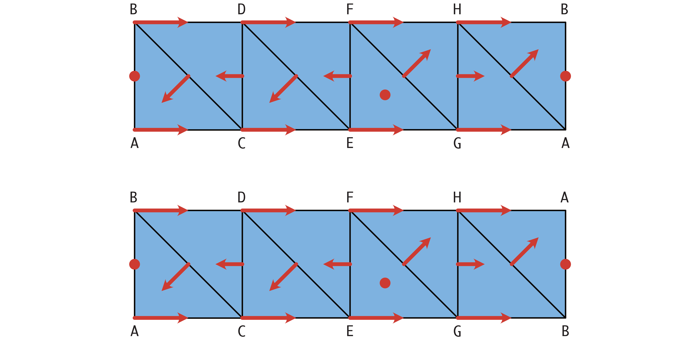
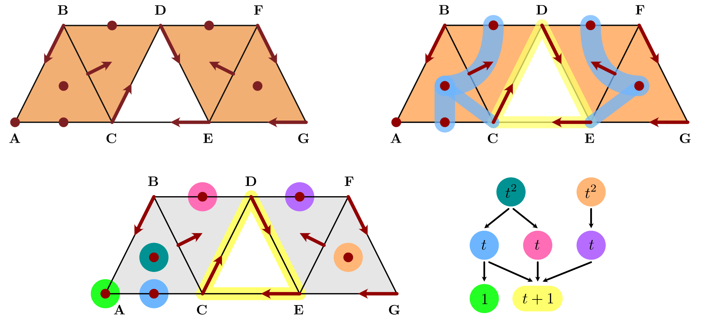
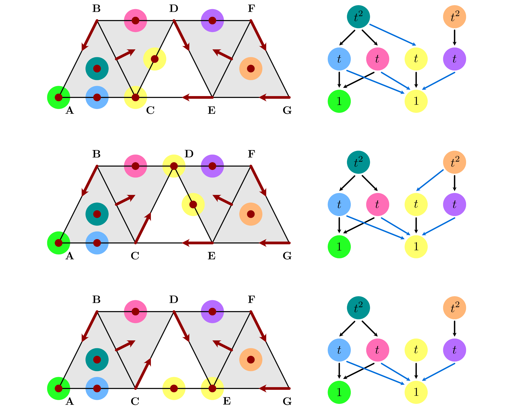

# Examples

```@meta
DocTestSetup = quote
    push!(LOAD_PATH,"../../../src/")
    using ConleyDynamics
end
```

In order to illustrate the basic functionality of `ConleyDynamics.jl`, 
this section collects a number of examples. Many of these are taken 
from the papers [batko:etal:20a](@cite) and [mrozek:wanner:p21a](@cite),
and they consider both Forman vector fields and general multivector
fields on a variety of Lefschetz complexes. Each example has its own
associated function, so that users can quickly create examples
on their own by taking the respective source files as templates.

## Critical Flow on a Simplex

The first example considers the arguably simplest situation of a
Forman vector field on a simplicial complex. The simplicial complex
``X`` is given by a single simplex of dimension ``n``, together
with all its faces, while the Forman vector field on ``X`` contains
only singletons. In other words, every simplex in the complex
is a critical cell. Thus, this combinatorial dynamical system has
one equilibrium of index ``n``, and ``n+1`` stable equilibria. In
addition, there are ``2^{n+1} - n - 3`` additional stationary states
whose indices lie strictly between ``0`` and ``n``, as well as a 
wealth of algebraically induced heteroclinic orbits. All of these
can be found by using the connection matrix for the problem, as
outlined in the following description for the function
[`example_critical_simplex`](@ref).

```@docs; canonical=false
example_critical_simplex(::Int)
```

## Flow on a Cylinder and a Moebius Strip

The next example considers again Forman vector fields, but this
time on a cylinder and on a Moebius strip. The underlying simplicial
complexes are given by a horizontal strip of eight triangles, whose
left and right vertical edges are identified. For the first complex
`lc1` these edges are identified without twist, while for the
complex `lc2` they are twisted. See also the labels in the figure.



Both complexes consist of eight vertices, sixteen edges, and eight
triangles. The two complexes and Forman vector fields can be generated
using the function [`example_critical_simplex`](@ref), whose usage
can be described as follows.

```@docs; canonical=false
example_moebius
```

Note that for the combinatorial flow on the Moebius strip `lc2` the
choice of field characteristic ``p`` leads to potentially different 
connection matrices. While for characteristic ``p=2`` the connection
matrix has only one nontrivial entry, it has two for ``p=7``.

We only briefly include some sample computations for the latter case.
One can create the complexes, Forman vector fields, and associated
connection matrices for ``p=7`` using the following commands:

```julia
lc1, mvf1, lc2, mvf2 = example_moebius(7)
cm1 = connection_matrix(lc1,mvf1)
cm2 = connection_matrix(lc2,mvf2)
```

For the first example, the combinatorial flow on the cylinder has
four Morse sets. Two critical equilibria of indices 1 and 2, as well
as two periodic orbits. This can be shown as follows:

```julia
julia> cm1.morse
4-element Vector{Vector{String}}:
 ["A", "C", "E", "G", "AC", "AG", "CE", "EG"]
 ["B", "D", "F", "H", "BD", "BH", "DF", "FH"]
 ["AB"]
 ["EFG"]

julia> cm1.conley
4-element Vector{Vector{Int64}}:
 [1, 1, 0]
 [1, 1, 0]
 [0, 1, 0]
 [0, 0, 1]

julia> sparse_show(cm1.matrix)
[0   0   0   0   6   0]
[0   0   0   0   0   1]
[0   0   0   0   1   0]
[0   0   0   0   0   6]
[0   0   0   0   0   0]
[0   0   0   0   0   0]

julia> print(cm1.labels)
["A", "AG", "B", "BH", "AB", "EFG"]
```

In fact, the connection matrix implies the existence of
connecting orbits from both the index 2 and the index 1
equilibrium to the two periodic orbits. The connections
between the stationary states cannot be detected 
algebraically.

For the second example, the combinatorial flow on the
Moebius strip, one only obtains three Morse sets. This
time, there is only one periodic orbit which loops
around both the top and bottom edges in the figure.
This is confirmed by the commands

```julia
julia> cm2.morse
3-element Vector{Vector{String}}:
 ["A", "B", "C", "D", "E", "F", "G", "H", "AC", "AH", "BD", "BG", "CE", "DF", "EG", "FH"]
 ["AB"]
 ["EFG"]

julia> cm2.conley
3-element Vector{Vector{Int64}}:
 [1, 1, 0]
 [0, 1, 0]
 [0, 0, 1]

julia> sparse_show(cm2.matrix)
[0   0   0   0]
[0   0   0   1]
[0   0   0   2]
[0   0   0   0]

julia> print(cm2.labels)
["A", "BG", "AB", "EFG"]
```

In this case, the connection matrix is able to identify the
connecting orbits between the index 2 stationary state and
both the periodic orbit and the index 1 equilibrium. The 
latter one is not recognized over the field ``GF(2)``.

## Nonunique Connection Matrices

Our next example is concerned with another Forman vector field,
but this time on a larger simplicial complex, as shown in the
figure.


The simplicial complex is topologically a disk, and it consists
of 9 vertices, 18 edges, and 10 triangles. The Forman vector field
has 1 critical vertex, 3 critical edges, and 3 critical triangles,
as well as 15 Forman arrows. The following example shows that
for this combinatorial dynamical system, there are two fundamentally
different connection matrices.

```@docs; canonical=false
example_nonunique()
```

As mentioned in the docstring for the function [`example_nonunique`](@ref),
the two Lefschetz complexes `lc1` and `lc2` both represent the above
simplicial complex. However, they differ in the ordering of the vertex
labels. This can be seen from the commands

```julia
julia> print(lc1.labels[1:9])
["1", "2", "3", "4", "5", "6", "7", "8", "9"]
julia> print(lc2.labels[1:9])
["1", "2", "3", "4", "5", "6", "8", "9", "7"]
```

In other words, `lc1` and `lc2` are different representations of
the same complex. Nevertheless, computing the connection matrices
as in the example gives two distinct connection matrices. This is
purely a consequence of the different ordering of the rows and 
columns in the boundary matrix.

To shed further light on this issue, notice that the triangle
at the center of the complex forms an attracting periodic orbit, 
whose Conley index has Betti numbers 1 in dimensions 0 and 1.
One can break this periodic orbit by removing one of its three
arrows, and replacing it with two critical cells of dimensions
0 and 1. The next image shows two different ways of doing this.


In the image on the left, the vector `["7", "79"]` is removed,
while the one on the right breaks up `["8", "78"]`. The corresponding
modified Forman vector fields, and their connection matrices, can be
created as follows:

```julia
mvf1 = deepcopy(mvf);
mvf2 = deepcopy(mvf);
deleteat!(mvf1,6);
deleteat!(mvf2,8);
cm1mod = connection_matrix(lc1, mvf1);
cm2mod = connection_matrix(lc2, mvf2);
```

Both of the new Forman vector fields are gradient vector fields, and
in view of a result in [mrozek:wanner:p21a](@cite), their connection
matrices are therefore uniquely determined. The connection matrix for
the vector field `mvf1` is of the form

```julia
julia> sparse_show(cm1mod.matrix)
[0   0   1   0   1   0   0   0   0]
[0   0   1   0   1   0   0   0   0]
[0   0   0   0   0   0   1   1   0]
[0   0   0   0   0   0   0   1   0]
[0   0   0   0   0   0   1   1   0]
[0   0   0   0   0   0   0   1   1]
[0   0   0   0   0   0   0   0   0]
[0   0   0   0   0   0   0   0   0]
[0   0   0   0   0   0   0   0   0]

julia> print(cm1mod.labels)
["2", "7", "29", "45", "67", "79", "168", "349", "789"]
```

Notice that this matrix shows that there is a connection from
the triangle `349` to the edge `79`, but there are no connections
from the triangle `168` to the critical edge on the center triangle.
In fact, up to reordering the columns and rows, this connection 
matrix is the same as `cm1` in the example.

Similarly, the connection matrix for the second modified Forman
vector field `mvf2` is uniquely determined, and it is given by

```julia
julia> sparse_show(cm2mod.matrix)
[0   0   1   0   1   0   0   0   0]
[0   0   1   0   1   0   0   0   0]
[0   0   0   0   0   0   1   1   0]
[0   0   0   0   0   0   0   1   0]
[0   0   0   0   0   0   1   1   0]
[0   0   0   0   0   0   1   0   1]
[0   0   0   0   0   0   0   0   0]
[0   0   0   0   0   0   0   0   0]
[0   0   0   0   0   0   0   0   0]

julia> print(cm2mod.labels)
["2", "8", "29", "45", "67", "78", "168", "349", "789"]
```

Now there is a connection from the triangle `168` to the edge `78`,
but there are no connections from the triangle `349` to the critical
edge on the center triangle. This time, up to a permutation of the
columns and the rows, this connection matrix is the same as `cm2`
in the example.

## Forcing Three Different Connection Matrices

The following examples are taken from [mrozek:wanner:p21a](@cite).



```@docs; canonical=false
example_MW_fig02()
```





## Further Connection Matrix Examples

The following examples are taken from [mrozek:wanner:p21a](@cite).

```@docs; canonical=false
example_MW_fig01()
```

```@docs; canonical=false
example_MW_fig03()
```

```@docs; canonical=false
example_MW_fig04()
```

```@docs; canonical=false
example_MW_fig11()
```

## Forman Vector Field Examples

The following examples are taken from [batko:etal:20a](@cite).

```@docs; canonical=false
example_BKMW20_fig1()
```


```@docs; canonical=false
example_BKMW20_fig3()
```


## [References](@id refexamples)

See the [full bibliography](@ref References) for a complete list
of references cited throughout this documentation. This section cites
the following references:

```@bibliography
Pages = ["examples.md"]
Canonical = false
```

