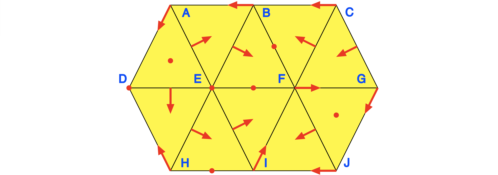
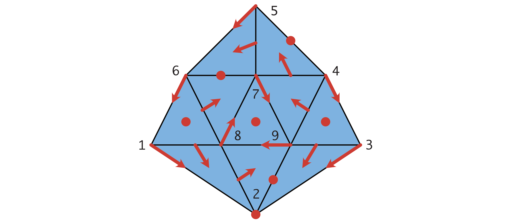
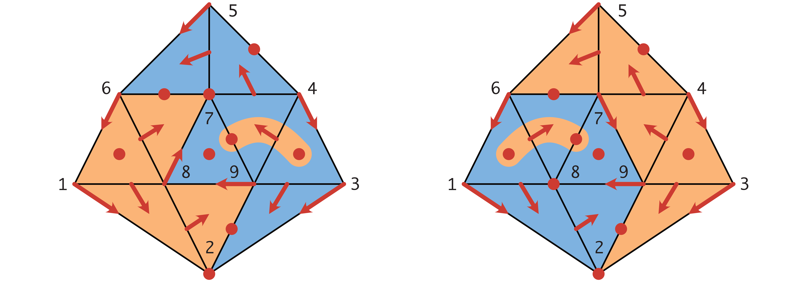
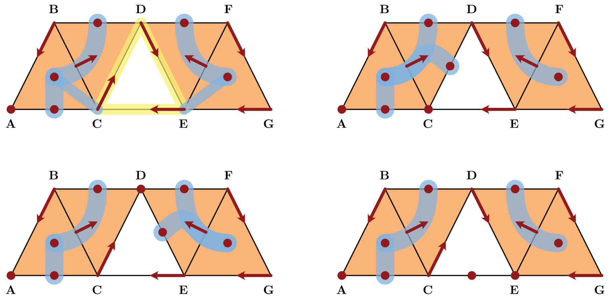
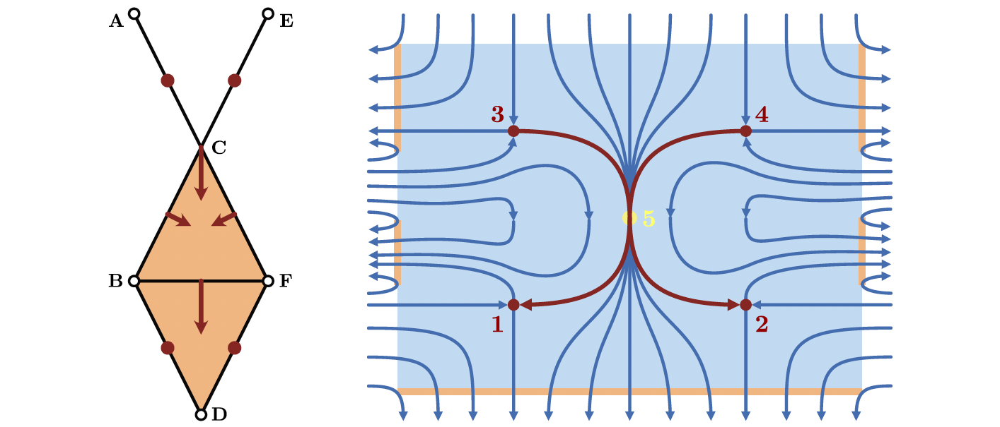
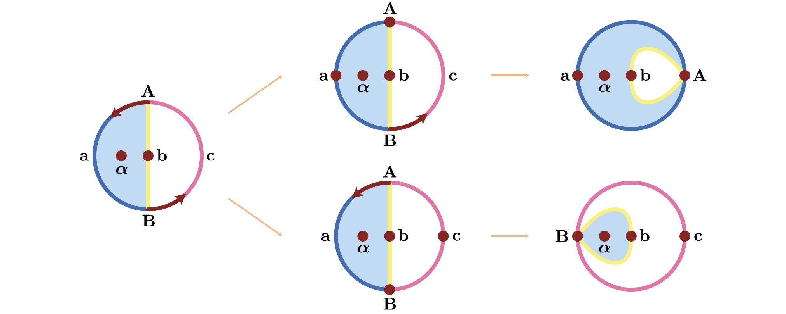
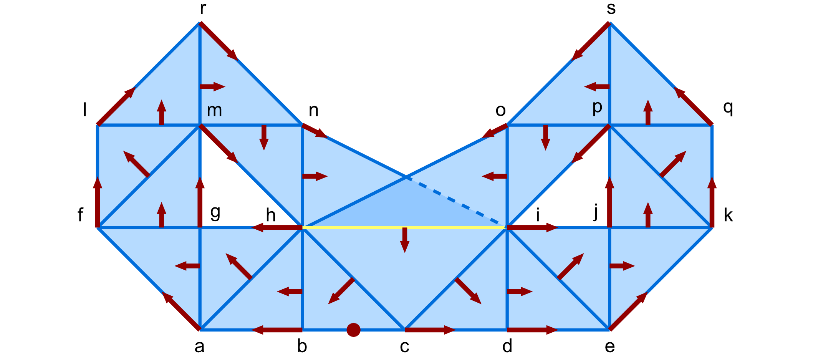
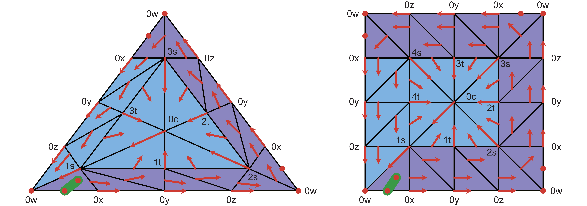

# Examples

```@meta
DocTestSetup = quote
    push!(LOAD_PATH,"../../../src/")
    using ConleyDynamics
end
```

In order to illustrate the basic functionality of
[ConleyDynamics.jl](https://almost6heads.github.io/ConleyDynamics.jl), 
this section collects a number of examples. Many of these are taken 
from the paper [batko:etal:20a](@cite) and the book [mrozek:wanner:25a](@cite),
and they consider both Forman vector fields and general multivector
fields on a variety of Lefschetz complexes. Each example has its own
associated function, so that users can quickly create examples
on their own by taking the respective source files as templates.

## A One-Dimensional Forman Field

Our first example is taken from [batko:etal:20a; Figure 1](@cite),
and it is a Forman vector field on a one-dimensional simplicial
complex as shown in the figure.


The simplicial complex and Forman vector field can be created using
the function [`example_forman1d`](@ref):

```@docs; canonical=false
example_forman1d()
```

The commands from the docstring show that the connection matrix has
five rows and columns. The last three of these correspond to the
critical cells ``\mathrm{F}``, ``\mathrm{BF}``, and ``\mathrm{DE}``,
while the first two correspond to the two generators of the homological
Conley index of the periodic orbit, given by ``\mathrm{A}`` and
``\mathrm{AD}``.


The full Morse decomposition of this combinatorial dynamical system
is depicted in the second figure, and all four Morse set are indicated
in the simplicial complex by different colors. They are also listed,
together with their Conley indices, in the following Julia output:

```julia
julia> cm.morse
4-element Vector{Vector{String}}:
 ["A", "C", "D", "AC", "AD", "CD"]
 ["F"]
 ["BF"]
 ["DE"]

julia> cm.conley
4-element Vector{Vector{Int64}}:
 [1, 1]
 [1, 0]
 [0, 1]
 [0, 1]
```

Notice that only two heteroclinic orbits are reflected in the
connection matrix. These are the connections between the unstable
cell ``\mathrm{DE}`` and both the equilibrium ``\mathrm{F}`` and
the periodic orbit. In contrast, the two heteroclinics between
the index one cell ``\mathrm{BF}`` and ``\mathrm{F}`` cancel
algebraically.

## A Planar Forman Vector Field

Our second example was originally discussed in the context of 
[batko:etal:20a; Figure 3](@cite), and it consists of a Forman 
vector field on a topological disk, as shown in the associated
figure.



The disk is represented as a simplicial complex with 10 vertices,
19 edges, and 10 triangles. The Forman vector field has 7 critical
cells, and 16 arrows. Both the simplicial complex and the Forman
vector field can be defined using the function
[`example_forman2d`](@ref):

```@docs; canonical=false
example_forman2d()
```


The Morse decomposition of this example is shown in the second
figure. Its eight Morse sets and associated Conley indices are
given by

```julia
julia> cm.morse
8-element Vector{Vector{String}}:
 ["D"]
 ["E"]
 ["F", "G", "I", "J", "FG", "FI", "GJ", "IJ"]
 ["BF"]
 ["EF"]
 ["HI"]
 ["ADE"]
 ["FGJ"]

julia> cm.conley
8-element Vector{Vector{Int64}}:
 [1, 0, 0]
 [1, 0, 0]
 [1, 1, 0]
 [0, 1, 0]
 [0, 1, 0]
 [0, 1, 0]
 [0, 0, 1]
 [0, 0, 1]
```

We would like to point out that the collection of Morse sets
does not in general encompass all possible isolated invariant
sets for the combinatorial dynamical system. Consider for 
example the set ``S`` shown in light blue in the next figure.


Its mouth is depicted in dark blue, and it is clearly closed.
In addition, the set ``S`` decomposes into arrows and critical
cells, and one can show that it is invariant. Thus, it is in 
fact an isolated invariant set for this Forman vector field.
Note also that this cell does not correspond to an interval
in the Conley-Morse graph either, and this is indicated via gray
shading in the above image of the graph. The set ``S``, together
with its closure and its mouth, can be generated using the 
following commands:

```julia
S = ["ADE","DEH","EFI","EHI",
     "DE","EF","EH","EI","FG","FI","GJ","HI","IJ",
     "F","G","I","J"]
clS, moS = lefschetz_clomo_pair(lc,S)
```

Then the Conley index of ``S`` is given by

```julia
julia> conley_index(lc,S)
3-element Vector{Int64}:
 0
 1
 0

julia> relative_homology(lc,clS,moS)
3-element Vector{Int64}:
 0
 1
 0
```

Notice that this is the same as the relative homology of the
pair ``(\mathrm{cl}\, S, \mathrm{mo}\, S)``, as expected.

## The Multivector Field from the Logo

This example is taken from [mrozek:wanner:25a; Figure 2.1](@cite),
and it is visualized in the accompanying figure.


Clearly, this is the multivector field from the
[ConleyDynamics.jl](https://almost6heads.github.io/ConleyDynamics.jl)
logo. Since it was already discussed in detail in the [Tutorial](@ref),
we only show how the underlying simplicial complex and the multivector
field can be created quickly using the function [`example_julia_logo`](@ref):

```@docs; canonical=false
example_julia_logo()
```

The Morse sets and associated Conley indices can be accessed using
the commands:

```julia
julia> cm.morse
3-element Vector{Vector{String}}:
 ["D"]
 ["A", "B", "C", "AB", "AC", "BC", "BD", "CD", "BCD"]
 ["ABC"]

julia> cm.conley
3-element Vector{Vector{Int64}}:
 [1, 0, 0]
 [0, 1, 0]
 [0, 0, 1]
```

Notice that in this example, every simplex of the underlying
simplicial complex is contained in one of the Morse sets.

## Critical Flow on a Simplex

The next example considers the arguably simplest situation of a
Forman vector field on a simplicial complex. The simplicial complex
``X`` is given by a single simplex of dimension ``n``, together
with all its faces, while the Forman vector field on ``X`` contains
only singletons. In other words, every simplex in the complex
is a critical cell. Thus, this combinatorial dynamical system has
one equilibrium of index ``n``, and ``n+1`` stable equilibria. In
addition, there are ``2^{n+1} - n - 3`` additional stationary states
whose indices lie strictly between ``0`` and ``n``, as well as a 
wealth of algebraically induced heteroclinic orbits. All of these
can be found by using the connection matrix for the problem, as
outlined in the following description for the function
[`example_critical_simplex`](@ref).

```@docs; canonical=false
example_critical_simplex(::Int)
```

## Flow on a Cylinder and a Moebius Strip

The next example considers again Forman vector fields, but this
time on a cylinder and on a Moebius strip. The underlying simplicial
complexes are given by a horizontal strip of eight triangles, whose
left and right vertical edges are identified. For the first complex
`lc1` these edges are identified without twist, while for the
complex `lc2` they are twisted. See also the labels in the figure.


Both complexes consist of eight vertices, sixteen edges, and eight
triangles. The two complexes and Forman vector fields can be generated
using the function [`example_critical_simplex`](@ref), whose usage
can be described as follows.

```@docs; canonical=false
example_moebius
```

Note that for the combinatorial flow on the Moebius strip `lc2` the
choice of field characteristic ``p`` leads to potentially different 
connection matrices. While for characteristic ``p=2`` the connection
matrix has only one nontrivial entry, it has two for ``p=7``.

We only briefly include some sample computations for the latter case.
One can create the complexes, Forman vector fields, and associated
connection matrices for ``p=7`` using the following commands:

```julia
lc1, mvf1, lc2, mvf2 = example_moebius(7)
cm1 = connection_matrix(lc1,mvf1)
cm2 = connection_matrix(lc2,mvf2)
```

For the first example, the combinatorial flow on the cylinder has
four Morse sets. Two critical equilibria of indices 1 and 2, as well
as two periodic orbits. This can be shown as follows:

```julia
julia> cm1.morse
4-element Vector{Vector{String}}:
 ["A", "C", "E", "G", "AC", "AG", "CE", "EG"]
 ["B", "D", "F", "H", "BD", "BH", "DF", "FH"]
 ["AB"]
 ["EFG"]

julia> cm1.conley
4-element Vector{Vector{Int64}}:
 [1, 1, 0]
 [1, 1, 0]
 [0, 1, 0]
 [0, 0, 1]

julia> sparse_show(cm1.matrix)
[0   0   0   0   6   0]
[0   0   0   0   0   1]
[0   0   0   0   1   0]
[0   0   0   0   0   6]
[0   0   0   0   0   0]
[0   0   0   0   0   0]

julia> print(cm1.labels)
["A", "AG", "B", "BH", "AB", "EFG"]
```

In fact, the connection matrix implies the existence of
connecting orbits from both the index 2 and the index 1
equilibrium to the two periodic orbits. The connections
between the stationary states cannot be detected 
algebraically.

For the second example, the combinatorial flow on the
Moebius strip, one only obtains three Morse sets. This
time, there is only one periodic orbit which loops
around both the top and bottom edges in the figure.
This is confirmed by the commands

```julia
julia> cm2.morse
3-element Vector{Vector{String}}:
 ["A", "B", "C", "D", "E", "F", "G", "H", "AC", "AH", "BD", "BG", "CE", "DF", "EG", "FH"]
 ["AB"]
 ["EFG"]

julia> cm2.conley
3-element Vector{Vector{Int64}}:
 [1, 1, 0]
 [0, 1, 0]
 [0, 0, 1]

julia> sparse_show(cm2.matrix)
[0   0   0   0]
[0   0   0   1]
[0   0   0   2]
[0   0   0   0]

julia> print(cm2.labels)
["A", "BG", "AB", "EFG"]
```

In this case, the connection matrix is able to identify the
connecting orbits between the index 2 stationary state and
both the periodic orbit and the index 1 equilibrium. The 
latter one is not recognized over the field ``GF(2)``.

## Nonunique Connection Matrices

Our next example is concerned with another Forman vector field,
but this time on a larger simplicial complex, as shown in the
figure.



The simplicial complex is topologically a disk, and it consists
of 9 vertices, 18 edges, and 10 triangles. The Forman vector field
has 1 critical vertex, 3 critical edges, and 3 critical triangles,
as well as 15 Forman arrows. The following example shows that
for this combinatorial dynamical system, there are two fundamentally
different connection matrices.

```@docs; canonical=false
example_nonunique()
```

As mentioned in the docstring for the function [`example_nonunique`](@ref),
the two Lefschetz complexes `lc1` and `lc2` both represent the above
simplicial complex. However, they differ in the ordering of the vertex
labels. This can be seen from the commands

```julia
julia> print(lc1.labels[1:9])
["1", "2", "3", "4", "5", "6", "7", "8", "9"]
julia> print(lc2.labels[1:9])
["1", "2", "3", "4", "5", "6", "8", "9", "7"]
```

In other words, `lc1` and `lc2` are different representations of
the same complex. Nevertheless, computing the connection matrices
as in the example gives two distinct connection matrices. This is
purely a consequence of the different ordering of the rows and 
columns in the boundary matrix.

To shed further light on this issue, notice that the triangle
at the center of the complex forms an attracting periodic orbit, 
whose Conley index has Betti numbers 1 in dimensions 0 and 1.
One can break this periodic orbit by removing one of its three
arrows, and replacing it with two critical cells of dimensions
0 and 1. The next image shows two different ways of doing this.



In the image on the left, the vector `["7", "79"]` is removed,
while the one on the right breaks up `["8", "78"]`. The corresponding
modified Forman vector fields, and their connection matrices, can be
created as follows:

```julia
mvf1 = deepcopy(mvf);
mvf2 = deepcopy(mvf);
deleteat!(mvf1,6);
deleteat!(mvf2,8);
cm1mod = connection_matrix(lc1, mvf1);
cm2mod = connection_matrix(lc2, mvf2);
```

Both of the new Forman vector fields are gradient vector fields, and
in view of a result in [mrozek:wanner:25a](@cite), their connection
matrices are therefore uniquely determined. The connection matrix for
the vector field `mvf1` is of the form

```julia
julia> sparse_show(cm1mod.matrix)
[0   0   1   0   1   0   0   0   0]
[0   0   1   0   1   0   0   0   0]
[0   0   0   0   0   0   1   1   0]
[0   0   0   0   0   0   0   1   0]
[0   0   0   0   0   0   1   1   0]
[0   0   0   0   0   0   0   1   1]
[0   0   0   0   0   0   0   0   0]
[0   0   0   0   0   0   0   0   0]
[0   0   0   0   0   0   0   0   0]

julia> print(cm1mod.labels)
["2", "7", "29", "45", "67", "79", "168", "349", "789"]
```

Notice that this matrix shows that there is a connection from
the triangle `349` to the edge `79`, but there are no connections
from the triangle `168` to the critical edge on the center triangle.
In fact, up to reordering the columns and rows, this connection 
matrix is the same as `cm1` in the example.

Similarly, the connection matrix for the second modified Forman
vector field `mvf2` is uniquely determined, and it is given by

```julia
julia> sparse_show(cm2mod.matrix)
[0   0   1   0   1   0   0   0   0]
[0   0   1   0   1   0   0   0   0]
[0   0   0   0   0   0   1   1   0]
[0   0   0   0   0   0   0   1   0]
[0   0   0   0   0   0   1   1   0]
[0   0   0   0   0   0   1   0   1]
[0   0   0   0   0   0   0   0   0]
[0   0   0   0   0   0   0   0   0]
[0   0   0   0   0   0   0   0   0]

julia> print(cm2mod.labels)
["2", "8", "29", "45", "67", "78", "168", "349", "789"]
```

Now there is a connection from the triangle `168` to the edge `78`,
but there are no connections from the triangle `349` to the critical
edge on the center triangle. This time, up to a permutation of the
columns and the rows, this connection matrix is the same as `cm2`
in the example.

## Forcing Three Connection Matrices

The next example is taken from [mrozek:wanner:25a; Figure 2.2](@cite),
and it revolves around the combinatorial vector field on a simplicial 
complex shown in the top left part of the figure.


This combinatorial vector field is again of Forman type. It has 
a periodic orbit, which is shown in yellow in the top right part
of the figure. In addition to three index 1 equilibria, there are
two of index 2. The top right part shows that from these two index
2 cells there are a combined total of five connecting orbits to
the index 1 cells and to the periodic orbit. Its Morse decomposition
is shown in the lower part of the figure. While the Morse sets are
indicated by different colors, the Conley-Morse graph is shown on
the lower right.

As the following docstring for [`example_three_cm`](@ref) demonstrates,
the connection matrix, which this time is computed over the rationals
``\mathbb{Q}``, only identifies three of the five connecting orbits
between index 2 invariant sets and index 1 sets.

```@docs; canonical=false
example_three_cm()
```

It turns out that this combinatorial dynamical system has multiple
possible connection matrices as well. In fact, it has three. In order
to find them we use the same approach as in the last example, and 
break the periodic orbit by turning one of its arrows into two
critical cells. Since there are three arrows in the periodic 
orbit, this can be accomplished in three different ways. They
are indicated in the next figure.



The resulting Forman vector fields are all of gradient type, and
therefore have a unique connection matrix. These three vector
fields can be obtained via the function [`example_three_cm`](@ref)
by specifying the integer argument as `1`, `2`, or `3`. For the
first vector field one obtains the following connection matrix:

```julia
julia> lc1, mvf1 = example_three_cm(1);

julia> cm1 = connection_matrix(lc1, mvf1);

julia> print(cm1.labels)
["A", "C", "AC", "BD", "CD", "DF", "ABC", "EFG"]

julia> full_from_sparse(cm1.matrix)
8×8 Matrix{Rational{Int64}}:
 0  0  -1  -1  0  0   0  0
 0  0   1   1  0  0   0  0
 0  0   0   0  0  0  -1  0
 0  0   0   0  0  0   1  0
 0  0   0   0  0  0  -1  0
 0  0   0   0  0  0   0  1
 0  0   0   0  0  0   0  0
 0  0   0   0  0  0   0  0
```

In contrast, the second vector field leads to:

```julia
julia> lc2, mvf2 = example_three_cm(2);

julia> cm2 = connection_matrix(lc2, mvf2);

julia> print(cm2.labels)
["A", "D", "AC", "BD", "DE", "DF", "ABC", "EFG"]

julia> full_from_sparse(cm2.matrix)
8×8 Matrix{Rational{Int64}}:
 0  0  -1  -1  0  0   0   0
 0  0   1   1  0  0   0   0
 0  0   0   0  0  0  -1   0
 0  0   0   0  0  0   1   0
 0  0   0   0  0  0   0  -1
 0  0   0   0  0  0   0   1
 0  0   0   0  0  0   0   0
 0  0   0   0  0  0   0   0
```

Finally, the third gradient vector field gives:

```julia
julia> lc3, mvf3 = example_three_cm(3);

julia> cm3 = connection_matrix(lc3, mvf3);

julia> print(cm3.labels)
["A", "E", "AC", "BD", "CE", "DF", "ABC", "EFG"]

julia> full_from_sparse(cm3.matrix)
8×8 Matrix{Rational{Int64}}:
 0  0  -1  -1  0  0   0  0
 0  0   1   1  0  0   0  0
 0  0   0   0  0  0  -1  0
 0  0   0   0  0  0   1  0
 0  0   0   0  0  0   0  0
 0  0   0   0  0  0   0  1
 0  0   0   0  0  0   0  0
 0  0   0   0  0  0   0  0
```

This is finally the connection matrix that was originally returned
for the Forman vector field with periodic orbit. One could have
obtained the remaining two also through cell permutations.

Notice that these three matrices combined do identify all of the
above connections. It was shown in [mrozek:wanner:25a](@cite)
that these matrices are different connection matrices for the
original Forman vector field with periodic orbit, as long as the
newly introduced index 1 and 0 equilibria are identified with the
Conley index of the periodic solution. For the sake of completeness,
the next figure shows the Morse decompositions for all three
combinatorial gradient flows. In the Conley-Morse graphs, blue
arrows correspond to the heteroclinic orbits that are identified
by the associated connection matrix.


In the Conley-Morse graphs, we used the same color yellow for the
two Morse sets that are generated by breaking the periodic orbit
through the introduction of two critical cells. It can be seen
from the images that while the actual Morse set structure stays
fixed, the poset order in the Conley-Morse graphs changes from
case to case.

## A Lefschetz Multiflow Example

The next example is taken from [mrozek:wanner:25a; Figure 2.3](@cite),
and it is a combinatorial multivector field on a true Lefschetz 
complex, as shown in the left panel of the associated figure.



The example is a combinatorial representation of the multiflow shown
on the right, which features nonunique forward dynamics at the point
labeled ``5``. Note that the underlying Lefschetz complex is defined
as the subset of the depicted simplicial complex, where the vertices
``\mathrm{A}``, ``\mathrm{B}``, ``\mathrm{D}``, ``\mathrm{E}``, and
``\mathrm{F}`` have been removed. This Lefschetz complex `lc` and 
the depicted multivector field `mvf` can be created using the
function [`example_multiflow`](@ref):

```@docs; canonical=false
example_multiflow()
```

As the docstring shows, this example has a trivial connection
matrix. In other words, there are no connecting orbits in this
combinatorial dynamical system that are forced by topology.
In fact, one can easily see that due to the multivalued nature
of the dynamical system, one cannot expect any particular 
heteroclinic to be present.

The Morse decomposition of the system, and the associated 
Conley indices encompass precisely the four critical edges:

```julia
julia> cm.morse
4-element Vector{Vector{String}}:
 ["BD"]
 ["DF"]
 ["AC"]
 ["CE"]

julia> cm.conley
4-element Vector{Vector{Int64}}:
 [0, 1, 0]
 [0, 1, 0]
 [0, 1, 0]
 [0, 1, 0]
```

Combined with the fact that the connection matrix is trivial,
this means that the homology of the underlying Lefschetz
complex `lc` is the sum of the Conley indices of the Morse
sets. This can be confirmed using the function
[`homology`](@ref):

```julia
julia> homology(lc)
3-element Vector{Int64}:
 0
 4
 0
```

As we mentioned earlier, this is the same as the relative
homology of the full simplicial complex with respect to the
union of the five removed vertices.

## Small Complex with Periodicity

In [mrozek:wanner:25a; Figure 2.4](@cite) we introduced a small
Lefschetz complex with periodic orbit and nonunique connection
matrices. This complex consists of one 2-cell, three 1-cells,
and two 0-cells, and it is shown in the leftmost panel of the
figure.


On the complex, consider the multivector field depicted
in the middle of the figure, which consists of the critical 
cells ``\alpha`` and ``b``, as well as the two regular multivectors
``\{ A, a \}`` and ``\{ B, c \}``. For this small example, one can
easily determine the Morse decomposition, and it is shown in the
rightmost panel. The example can be generated in
[ConleyDynamics.jl](https://almost6heads.github.io/ConleyDynamics.jl)
using the function [`example_small_periodicity`](@ref):

```@docs; canonical=false
example_small_periodicity()
```

The function provides two different representations of the same
Lefschetz complex, which only differ in the ordering of the 1-cells.
This can be seen from the commands:

```julia
julia> print(lc1.labels)
["A", "B", "a", "b", "c", "alpha"]

julia> print(lc2.labels)
["A", "B", "c", "a", "b", "alpha"]
```

As the above docstring shows, these different versions lead to 
two different connection matrices `cm1` and `cm2`.



In this small example, one can easily determine the connection
matrices directly, as illustrated in the second figure. While
the detailed explanation can be found in [mrozek:wanner:25a](@cite),
this is basically accomplished by contracting one of the two
regular multivectors in a process called *elementary reduction*.
While the details of this approach are described in
[kaczynski:etal:98a](@cite), it relies on identifying a *reduction
pair*, which contains a cell and one of its faces of one dimension less.
These two cells are then removed from the Lefschetz complex and the
boundary is modified in such a way that the new smaller complex still
has the same homology as the previous one. If in our above example
one uses the reduction pair ``\{ B, c \}``, then the boundary matrix
of the reduced Lefschetz complex is the connection matrix `cm1`,
while `cm2` is the result of using the reduction pair ``\{ A, a \}``.
These manipulations can be done in
[ConleyDynamics.jl](https://almost6heads.github.io/ConleyDynamics.jl)
using the function [`lefschetz_reduction`](@ref):

```julia
julia> rc1 = lefschetz_reduction(lc1, "B", "c");

julia> rc2 = lefschetz_reduction(lc1, "A", "a");
```

These two commands compute the reduced Lefschetz complexes `rc1`
and `rc2` for the respective elementary reduction pairs ``\{ B, c \}``
and ``\{ A, a \}``. As the following commands show, the
first one leads to our earlier connection matrix `cm1`:

```julia
julia> full_from_sparse(rc1.boundary)
4×4 Matrix{Int64}:
 0  0  0  0
 0  0  0  1
 0  0  0  1
 0  0  0  0

julia> println(rc1.labels)
["A", "a", "b", "alpha"]
```

Similarly, the connection matrix `cm2` is the result of the second
reduction:

```julia
julia> full_from_sparse(rc2.boundary)
4×4 Matrix{Int64}:
 0  0  0  0
 0  0  0  1
 0  0  0  0
 0  0  0  0

julia> println(rc2.labels)
["B", "b", "c", "alpha"]
```

## Subdividing a Multivector

Our next example taken from [mrozek:wanner:25a](@cite) is concerned
with turning a given multivector field into a Forman vector field
by further subdividing the multivectors. For this, consider the
three complexes and combinatorial vector fields shown in the
associated figure, see also [mrozek:wanner:25a; Figure 7.1](@cite).


The depicted combinatorial dynamical systems all use the same
Lefschetz complex, which is obtained from a simplicial complex
by removing two vertices. In addition to the multivector field
shown in the leftmost panel, we also consider two Forman vector
fields. Notice that the multivector field has one multivector
of size four, which is given by ``\{ \mathrm{C}, \mathrm{AC}, 
\mathrm{BC}, \mathrm{ABC} \}``. This vector can be split into
two Forman arrows, and in view of the required local closedness
this can be achieved in precisely two ways. The splitting into
the arrows ``\{ \mathrm{C}, \mathrm{AC} \}`` and ``\{ \mathrm{BC},
\mathrm{ABC} \}`` gives the Forman vector field shown in the middle
panel, while the one depicted in the rightmost panel uses the
arrows ``\{ \mathrm{C}, \mathrm{BC} \}`` and ``\{ \mathrm{AC},
\mathrm{ABC} \}``. These fields can be created using the
function [`example_subdivision`](@ref):

```@docs; canonical=false
example_subdivision()
```

The different combinatorial vector fields can be selected via
the function argument, which is an integer between `0` and `2`,
from left to right in the figure. Thus, all fields and connection
matrices can be computed using the commands

```julia
lc0, mvf0 = example_subdivision(0)
lc1, mvf1 = example_subdivision(1)
lc2, mvf2 = example_subdivision(2)
cm0 = connection_matrix(lc0,mvf0)
cm1 = connection_matrix(lc1,mvf1)
cm2 = connection_matrix(lc2,mvf2)
```

All three vector fields give rise to the same Morse decomposition,
since in each case the vectors of length at least two are regular.
This can be seen for the multivector field below, and is analogous
for the two Forman vector fields.

```julia
julia> cm0.morse
5-element Vector{Vector{String}}:
 ["A"]
 ["B"]
 ["AB"]
 ["CD"]
 ["CE"]

julia> cm0.conley
5-element Vector{Vector{Int64}}:
 [1, 0, 0]
 [1, 0, 0]
 [0, 1, 0]
 [0, 1, 0]
 [0, 1, 0]
```

The three connection matrices are as follows:

```julia
julia> full_from_sparse(cm0.matrix)
5×5 Matrix{Rational{Int64}}:
 0  0  -1   0   0
 0  0   1  -1  -1
 0  0   0   0   0
 0  0   0   0   0
 0  0   0   0   0

julia> full_from_sparse(cm1.matrix)
5×5 Matrix{Rational{Int64}}:
 0  0  -1  -1  -1
 0  0   1   0   0
 0  0   0   0   0
 0  0   0   0   0
 0  0   0   0   0

julia> full_from_sparse(cm2.matrix)
5×5 Matrix{Rational{Int64}}:
 0  0  -1   0   0
 0  0   1  -1  -1
 0  0   0   0   0
 0  0   0   0   0
 0  0   0   0   0
```

Notice that the connection matrices for the two Forman vector
fields are uniquely determined, since both are gradient vector
fields. The matrices are, however, different. At first glance,
the connection matrix for `mvf0` is equal to the one for
`mvf2`. Yet, this is another example of nonuniqueness, and one
could produce also the connection matrix for `mvf1` through a
reordering of the cells in the Lefschetz complex.

## A Combinatorial Lorenz System

Our next example is taken from [kaczynski:etal:16a; Figure 3](@cite).
It is a Forman vector field on a two-dimensional simplicial complex,
as shown in the accompanying figure.



Notice that the underlying simplicial complex does not represent
a manifold in this case, but rather a *branched manifold*. As
indicated in the figure, the two triangles ``\mathbf{hin}`` and
``\mathbf{hio}`` only intersect in the edge ``\mathbf{hi}``, and
this edge is also contained in the third triangle ``\mathbf{chi}``.
This system is a combinatorial version of the famous *Lorenz
butterfly*, which is well-known for its chaotic behavior. The
simplicial complex and the Forman vector field can be created
using the function [`example_clorenz`](@ref):

```@docs; canonical=false
example_clorenz()
```

The first of the above commands creates the simplicial complex `lc`
and the Forman vector field `mvf`. These are then analyzed using
the following commands:

* Using `cm = connection_matrix(lc, mvf)` one can compute the 
  connection matrix of the example. This connection matrix has
  two nonzero entries, which indicate connecting orbits from
  the index 1 critical cell ``\mathbf{bc}`` to each of the
  stable periodic orbits spanned by the vertices
  ``\mathbf{h}``, ``\mathbf{g}``, ``\mathbf{m}`` and
  ``\mathbf{i}``, ``\mathbf{j}``, ``\mathbf{p}``, respectively.
* The command `ms, ps = morse_sets(lc, mvf, poset=true)` shows,
  however, that there is more to this example. While the above
  connection matrix indicates only three isolated invariant
  sets, there is actually a fourth one. In view of the 
  Conley index computation for these sets, the additional
  Morse set has trivial index, and therefore does not show
  up in the connection matrix. Notice that the partial order
  given by the flow, which is indicated by the matrix `ps`,
  implies that the Morse set with trivial index has a connection
  to the index 1 critical cell.

Upon closer inspection one can see that the last Morse set
is comprised of all triangles, as well as all edges which are
contained in at least two triangles. This set contains infinitely
many periodic orbits. For any bi-infinite sequence of symbols ``L``
and ``R`` there is a periodic orbit which loops around the left
hole for ``L`` and around the right hole for ``R``, as one traverses
the symbol sequence from left to right. Such behavior is one potential
indicator for chaos. In fact, it was shown in [mrozek:wanner:21a](@cite)
that it is possible to define a classical semiflow on the branched manifold
defined by `lc` which mimics the behavior of the Forman vector field.
And according to [mrozek:etal:22a](@cite), any such *admissible semiflow*
does indeed have infinitely many periodic orbits in the set determined
by the triangles.

## Chaos in a Space with Torsion

Our next example describes gradient Forman vector fields on simplicial
complexes with torsion whose connection matrices can have large entries,
as long as the underlying field has a large enough characteristic. In
addition, by merging two critical cells in the Forman gradient vector
field into an arrow, once obtains a Forman vector field with chaotic
behavior. The simplicial complexes are based on the function
[`simplicial_torsion_space`](@ref), and the Forman vector fields
can be seen in the associated figure for the cases ``n=3`` and
``n=4``.



After specifying the torsion coefficient ``n`` and the field characteristic
``p``, the underlying simplicial complex and the two Forman vector fields
can be created using the function [`example_torsion_chaos`](@ref):

```@docs; canonical=false
example_torsion_chaos
```

The first of the above commands creates the simplicial complex `sc`
and the two Forman vector fields. The gradient vector field is returned
in `vfG`, and it corresponds to the Forman vector fields shown in red 
in the accompanying figure. The return variable `vfC` gives the chaotic
Forman vector field. Is it obtained from the gradient field by combining
the two critical cells ``\mathrm{0w0x}`` and ``\mathrm{0w0x1s}`` into
a Forman arrow, which is indicated in green in the figure. Note that
this reverses the flow between these two simplices. In the above
example, we use ``n=3`` and ``p=7``.

The gradient Forman vector field `vfG` is then analyzed using the
following commands:

* The command `homology(sc)` shows that in the field ``GF(7)``, 
  the space has the homology of a point.
* The next command `cmG = connection_matrix(sc, vfG)` determines
  the connection matrix for the gradient system. As the entry
  `cmG.labels` shows, the Morse sets are the three simplices
  ``\mathrm{0w}``, ``\mathrm{0w0x}``, and ``\mathrm{0w0x1s}``,
  and the nontrivial entry in the connection matrix indicates
  three connections between the index ``2`` critical cell and
  the index ``1`` critical cell.

The next commands analyze the chaotic Forman vector field `vfC`:

* As before, the command `cmC = connection_matrix(sc, vfC)` 
  computes the connection matrix. This time, the matrix is the
  zero matrix with one row and column, which correspond to the
  stable critical cell ``\mathrm{0w}``.
* But there is nontrivial dynamics, as the command
  `msC, psC = morse_sets(sc, vfC, poset=true)` demonstrates.
  It produces *two Morse sets*. In addition to the stable
  critical cell, one also obtains an isolated invariant set
  with trivial index. This set exhibits chaotic behavior, and
  is shown in purple in the accompanying figure. In  the case
  ``n = 3``, it consists of ``26`` simplices. In the general
  case, it will have ``12n - 10`` simplices.
* The return variable `psC` gives the flow-induced order
  between the Morse sets, which shows that there are 
  heteroclinic orbits between the chaotic Morse set and
  the stable equilibrium.

## [References](@id refexamples)

See the [full bibliography](@ref References) for a complete list
of references cited throughout this documentation. This section cites
the following references:

```@bibliography
Pages = ["examples.md"]
Canonical = false
```

