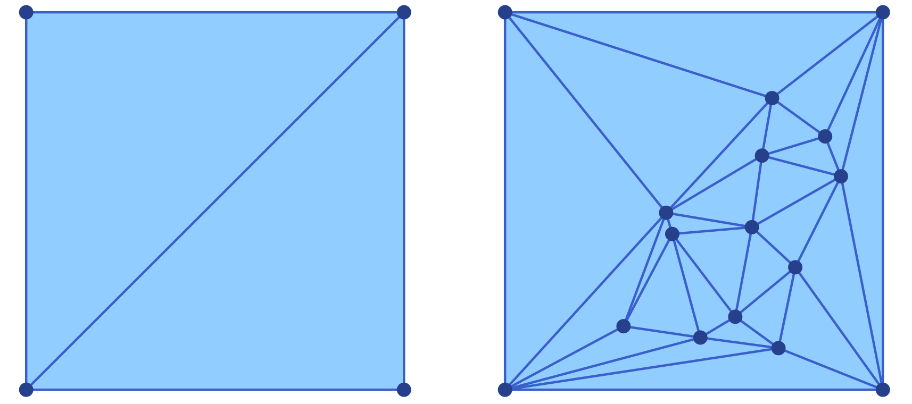
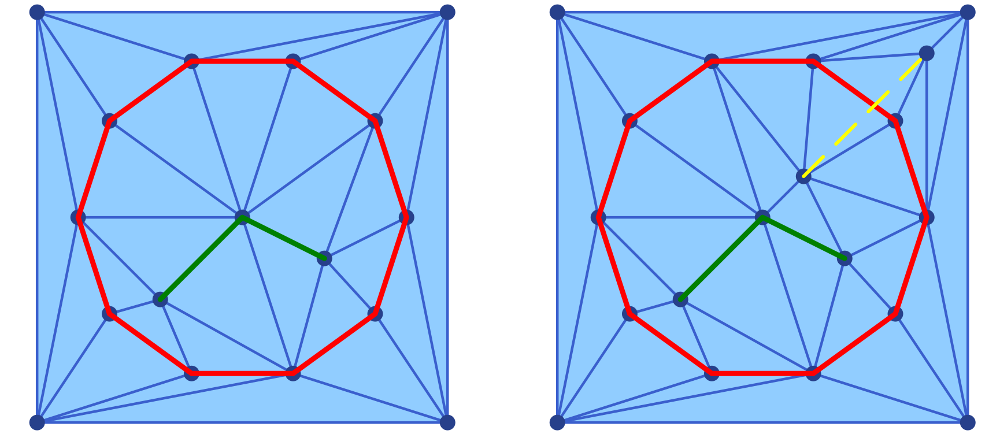
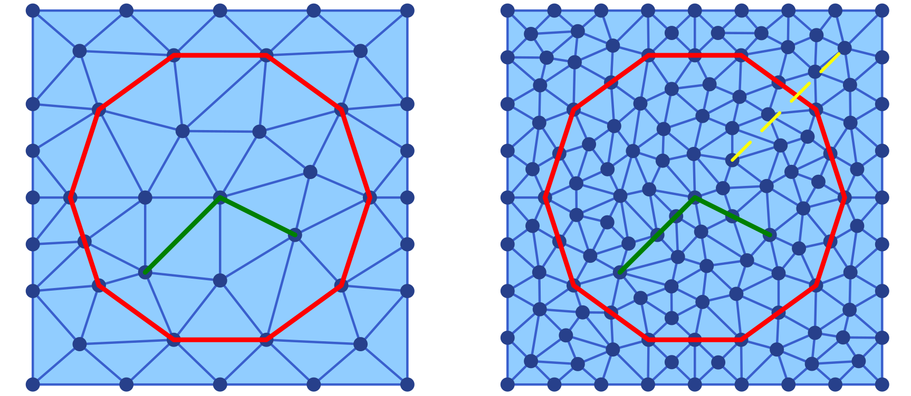
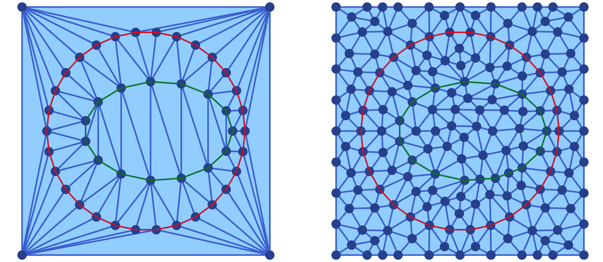

# Extensions

[ConleyDynamics.jl](https://almost6heads.github.io/ConleyDynamics.jl)
exposes optional functionality through *weak dependencies* — packages that
are loaded on demand and extend the library's capabilities without becoming
hard dependencies. This chapter documents the functions that become
available through these extensions. At present, two backends are provided:
`DelaunayTriangulation.jl` for constructing constrained planar triangulations
and converting them to simplicial complexes (described in the section below),
and `Plots.jl` for interactive visualization of Lefschetz complexes and their
dynamics (described in the [Visualization](@ref) chapter).

## DelaunayTriangulation.jl

The
[DelaunayTriangulation.jl](https://github.com/JuliaGeometry/DelaunayTriangulation.jl)
package computes Delaunay triangulations of planar point sets, optionally with
constrained edges and boundary curves.
Loading it alongside `ConleyDynamics.jl` activates three functions:

* [`delaunay_points_bnd_rectangle`](@ref) — initialise a point list and
  outer boundary for a rectangular domain,
* [`delaunay_points_add_segment`](@ref) — append constraint curves (closed
  or open) to that point list, and
* [`delaunay_to_simplicial`](@ref) — convert the finished triangulation into
  a [`EuclideanComplex`](@ref).

The typical workflow is to assemble the geometry with the first two functions,
call `triangulate` (and optionally `refine!`) from `DelaunayTriangulation.jl`,
and then convert the result with `delaunay_to_simplicial`.

### Defining the Bounding Domain

[`delaunay_points_bnd_rectangle`](@ref) creates a four-vertex rectangular
outer boundary. Its two arguments are vectors `bmin = [xmin, ymin]` and
`bmax = [xmax, ymax]` giving the lower-left and upper-right corners. It
returns a point list and a `bndcurve` in the format expected by the
`boundary_nodes` keyword of `triangulate`:

```julia
using DelaunayTriangulation
using ConleyDynamics

points, bndcurve = delaunay_points_bnd_rectangle([-5, -5], [5, 5])
tri1 = triangulate(points; boundary_nodes = bndcurve)
sc1  = delaunay_to_simplicial(tri1)
```

This already produces a valid `EuclideanComplex` — a triangulated filled
rectangle without any internal constraints. It is shown in the left panel
of the associated figure.



### Adding Interior Nodes

A finer triangulation of the underlying rectangle can be achieved by
adding interior nodes to the list of points describing the boundary.
This can be achieved with the function `delaunay_points_add_nodes`.
For example, we can add twelve interior nodes to the above square
using the following commands:

```julia
newpoints = [-4 .+ 8 .* rand(2) for k in 1:12]   # 12 random points
points    = delaunay_points_add_nodes(points, newpoints)

tri2 = triangulate(points; boundary_nodes = bndcurve)
sc2  = delaunay_to_simplicial(tri2)
```

This leads to the triangulation shown in the right panel of the above
figure. Note that the new triangulation makes use of all new interior
nodes, as well as the corners of the squares. The figure was created
using the commands

```julia
using Plots
p1 = plot_simplicial(sc1)
p2 = plot_simplicial(sc2)
pcombined = plot(p1, p2, layout=(1,2))
plot!(pcombined, dpi=300)
savefig(pcombined, "delaunayext1.png")
```

### Adding Constraint Curves

In many applications it is desirable to include certain polygonal curves
inside the domain as *constraint curves*, i.e., their edges have to
be part of the created Delaunay triangulation and any of its refinements.
Such constraint curves can be added to the initial mesh generation by
adding the vertices of the polygons to the point list, and specifying
the constraint edges in an argument `segments`, which has to be of
type `Set{Tuple{Int,Int}}`.

Such constraint curves can be generated as follows.
[`delaunay_points_add_segment`](@ref) appends a polygonal curve to the
point list and records successive point pairs as constrained edges. A curve
is passed as a `Vector{Vector{<:Real}}` of `[x, y]` coordinates. If the
first and last entries coincide (within a tolerance of `1e-9`), the curve is
treated as *closed* and no duplicate endpoint is stored; otherwise it is
treated as *open*.

The function has two calling forms. The two-argument form initialises a
fresh segment set and is convenient for the first constraint curve; the
three-argument form extends an existing `segments::Set{Tuple{Int,Int}}`:

```julia
using DelaunayTriangulation
using ConleyDynamics

points, bndcurve = delaunay_points_bnd_rectangle([-5, -5], [5, 5])

# Closed circular constraint (n+1 points with repeated first/last)
n      = 10
theta  = range(0, 2*pi, length = n+1)
circle = [[4.0 * cos(t), 4.0 * sin(t)] for t in theta]

# Open polygonal cut inside the domain
cut = [[-2.0, -2.0], [0.0, 0.0], [2.0, -1.0]]

points, segments = delaunay_points_add_segment(points, circle)          # 2-arg form
points, segments = delaunay_points_add_segment(points, segments, cut)   # 3-arg form

tri1 = triangulate(points; boundary_nodes = bndcurve, segments = segments)
sc1  = delaunay_to_simplicial(tri1)
```



The resulting Delaunay triangulation is shown in the left panel of the
figure. In addition to the generated mesh, it also shows the two contraint 
curves in red and green. This plot was generated using the following
commands:

```julia
using Plots

cirx = [pt[1] for pt in circle]
ciry = [pt[2] for pt in circle]
cutx = [pt[1] for pt in cut]
cuty = [pt[2] for pt in cut]

p1 = plot_simplicial(sc1)
plot!(p1, cirx, ciry, linewidth=3, color=:red)
plot!(p1, cutx, cuty, linewidth=3, color=:green)
```

We would like to point out that adding constraint curves to a triangulation
has to be done with care. More precisely, it is up to the user to ensure
that the **curves do not intersect each other** and that each curve is
**without interior self-intersections**. If these assumptions are not
satisfied, then
[DelaunayTriangulation.jl](https://github.com/JuliaGeometry/DelaunayTriangulation.jl)
will automatically remove some of the constraints. Consider for the
example the following additional commands:

```julia
# Open polygonal cut inside the domain
badcut = [[1.0, 1.0], [4.0, 4.0]]
points, segments = delaunay_points_add_segment(points, segments, badcut)

tri2 = triangulate(points; boundary_nodes = bndcurve, segments = segments)
sc2  = delaunay_to_simplicial(tri2)

badx = [pt[1] for pt in badcut]
bady = [pt[2] for pt in badcut]

p2 = plot_simplicial(sc2)
plot!(p2, cirx, ciry, linewidth=3, color=:red)
plot!(p2, cutx, cuty, linewidth=3, color=:green)
plot!(p2, badx, bady, linewidth=2, color=:yellow, linestyle=:dash)

pcombined12 = plot(p1, p2, layout=(1,2))
plot!(pcombined12, dpi=300)
savefig(pcombined12, "delaunayext2.png")
```

Clearly the added cut `badcut` intersects the circular constraint `circle`
from before. The mesh generated by `DelaunayTriangulation.jl` is shown in
the right panel of the above figure. Notice that the third constraint is
not respected by the triangulation, even though the two vertices from
the constraint have been added to the interior nodes.

### Mesh Refinement

After `triangulate`, `DelaunayTriangulation.jl` provides the function
`refine!` to improve the quality of the triangulation. Passing `max_area`
as a fraction of the total domain area and `min_angle` in degrees is a
practical starting point:

```julia
triarea1 = get_area(tri1)
refine!(tri1; max_area = 0.03 * triarea1, min_angle = 30.0)
sc3 = delaunay_to_simplicial(tri1)
```

The refined triangulation is then converted to a `EuclideanComplex` in the
same way as before. The optional argument `min_angle` has to be chosen with
care. If one chooses an angle larger than `30` then it is no longer certain
that an appropriate triangulation can be generated. The resulting triangulation
is shown in the left panel of the next figure.



We can also refine the second mesh from above, the one with the 
bad constraint curve `badcut`:

```julia
triarea2 = get_area(tri2)
refine!(tri2; max_area = 0.007 * triarea2, min_angle = 25.0)
sc4 = delaunay_to_simplicial(tri2)
```

The resulting triangulation is shown in the right panel of the above figure.
Notice that while the nodes determining `badcut` are still part of the
triangulation, the edge is not -- just as before. The above figure
was created using the following commands:

```julia
p3 = plot_simplicial(sc3)
plot!(p3, cirx, ciry, linewidth=3, color=:red)
plot!(p3, cutx, cuty, linewidth=3, color=:green)

p4 = plot_simplicial(sc4)
plot!(p4, cirx, ciry, linewidth=3, color=:red)
plot!(p4, cutx, cuty, linewidth=3, color=:green)
plot!(p4, badx, bady, linewidth=2, color=:yellow, linestyle=:dash)

pcombined34 = plot(p3, p4, layout=(1,2))
plot!(pcombined34, dpi=300)
savefig(pcombined34, "delaunayext3.png")
```

### Complete Example

The following self-contained snippet combines all three steps — bounding
rectangle, two circular constraints, mesh refinement, and conversion:

```julia
using Plots
using DelaunayTriangulation
using ConleyDynamics

# Bounding box
points, bndcurve = delaunay_points_bnd_rectangle([-5, -5], [5, 5])

# Outer ring (closed, 30 segments)
n1    = 30
th1   = range(0, 2*pi, length = n1+1)
ring  = [[4.0 * cos(t), 4.0 * sin(t)] for t in th1]
ringx = [pt[1] for pt in ring]
ringy = [pt[2] for pt in ring]
points, segments = delaunay_points_add_segment(points, ring)

# Inner elliptical disc (closed, 15 segments)
n2    = 15
th2   = range(0, 2*pi, length = n2+1)
disc  = [[0.5 + 3.0 * cos(t), 2.0 * sin(t)] for t in th2]
discx = [pt[1] for pt in disc]
discy = [pt[2] for pt in disc]
points, segments = delaunay_points_add_segment(points, segments, disc)

# Triangulate, refine, and convert
tri = triangulate(points; boundary_nodes = bndcurve, segments = segments)
sc1 = delaunay_to_simplicial(tri)

triarea = get_area(tri)
refine!(tri; max_area = 0.005 * triarea, min_angle = 27.0)
sc2 = delaunay_to_simplicial(tri)

# Plot the triangulations
p1 = plot_simplicial(sc1)
plot!(p1, ringx, ringy, color=:red)
plot!(p1, discx, discy, color=:green)

p2 = plot_simplicial(sc2)
plot!(p2, ringx, ringy, color=:red)
plot!(p2, discx, discy, color=:green)

pcombined = plot(p1, p2, layout=(1,2))
plot!(pcombined, dpi=300)
savefig(pcombined, "delaunayext4.png")
```

The resulting Delaunay triangulations are shown in the next figure.



