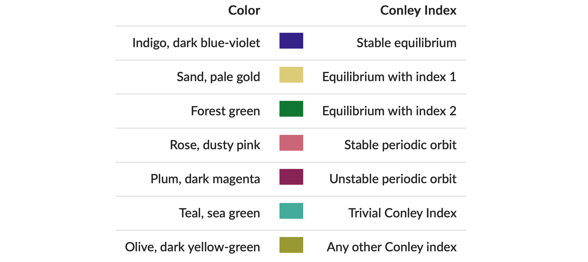
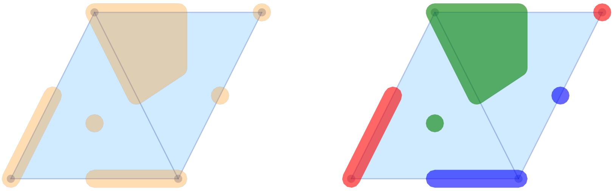
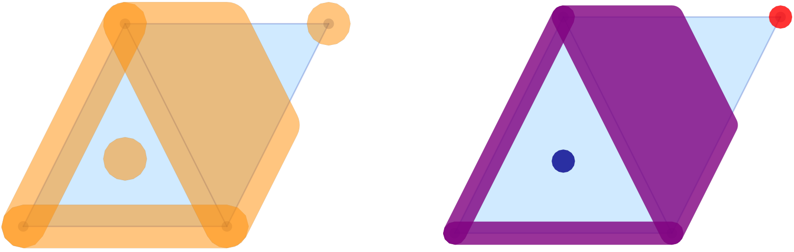
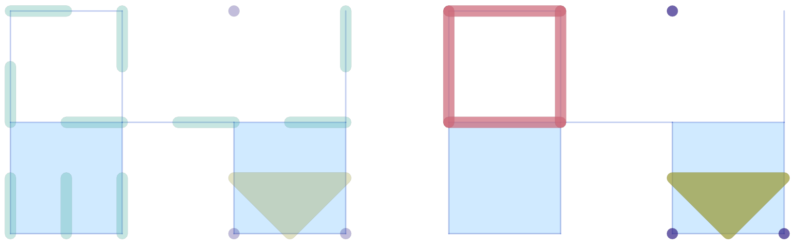
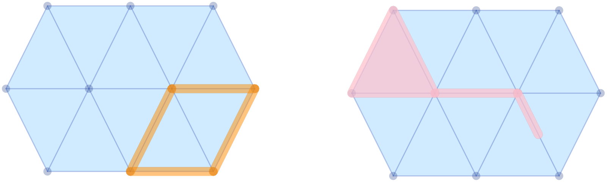

# Visualization

[ConleyDynamics.jl](https://almost6heads.github.io/ConleyDynamics.jl)
provides two independent visualization backends for planar complexes:
a *Luxor.jl-based* backend that produces PDF, PNG, or SVG files directly,
and a *Plots.jl-based* backend that integrates with the Julia plotting
ecosystem. The two backends are described in separate sections below.

## Luxor-Based Plotting

The functions
* [`plot_planar_simplicial`](@ref),
* [`plot_planar_simplicial_morse`](@ref),
* [`plot_planar_cubical`](@ref), and
* [`plot_planar_cubical_morse`](@ref)
produce publication-quality plots by writing directly to a PDF, PNG,
or SVG file via the [Luxor.jl](https://github.com/JuliaGraphics/Luxor.jl)
package. They require an explicit output filename and a separate
coordinate vector for the vertices of the complex. The type of the
image file is indicated by the filename ending.

As a simple example, the following commands create a PDF image of a
small simplicial complex together with its Morse sets:

```julia
using ConleyDynamics

lc, mvf = example_forman2d()
cm = connection_matrix(lc, mvf)
coords = [[50,200],[150,200],[250,200],[0,100],[100,100],
          [200,100],[300,100],[50,0],[150,0],[250,0]]
fname  = "forman2d_morse.pdf"
plot_planar_simplicial_morse(lc, coords, fname, cm.morse)
```

For cubical complexes the workflow is analogous. The function
[`get_cubical_coords`](@ref) extracts vertex coordinates from the
cube labels, so no separate coordinate vector needs to be specified
manually:

```julia
using ConleyDynamics

cc, coords = create_cubical_rectangle(4, 3)
fname = "cubical_rectangle.pdf"
plot_planar_cubical(cc, coords, fname)
```

Both families of Luxor functions also accept a [`EuclideanComplex`](@ref)
as their first argument. In that case the coordinate vector can be omitted
entirely. For example, the first of the above two plots can alternatively
be created using the following commands:

```julia
using ConleyDynamics

ec, mvf = example_forman2d(euclidean=true)
cm = connection_matrix(ec, mvf)
fname  = "forman2d_morse.pdf"
plot_planar_simplicial_morse(ec, fname, cm.morse)
```

## Plots-Based Plotting

The [Plots.jl](https://github.com/JuliaPlots/Plots.jl) backend provides
eight convenience functions:

| Function | Description |
|----------|-------------|
| [`plot_simplicial`](@ref) | Simplicial complex with optional Forman overlay |
| [`plot_cubical`](@ref) | Cubical complex with optional Forman overlay |
| [`plot_simplicial_morse`](@ref) | Simplicial complex with colored Morse sets |
| [`plot_cubical_morse`](@ref) | Cubical complex with colored Morse sets |
| [`plot_simplicial_mvf`](@ref) | Simplicial complex with multivector field regions |
| [`plot_cubical_mvf`](@ref) | Cubical complex with multivector field regions |
| [`plot_simplicial_mv`](@ref) | Single multivector on a simplicial complex |
| [`plot_cubical_mv`](@ref) | Single multivector on a cubical complex |

All of these functions are described with short examples in the remainder
of this section.

### Weak Dependency

[Plots.jl](https://github.com/JuliaPlots/Plots.jl) is a *weak
dependency* of
[ConleyDynamics.jl](https://almost6heads.github.io/ConleyDynamics.jl).
This means it is not loaded automatically when you do `using ConleyDynamics`,
and it does not need to be installed unless you want to use the
[Plots.jl](https://github.com/JuliaPlots/Plots.jl) backend. The eight
functions above are stub definitions that become active only after
[Plots.jl](https://github.com/JuliaPlots/Plots.jl) has been loaded.
The required loading order is:

```julia
using Plots
using ConleyDynamics
```

If ConleyDynamics is loaded *before*
[Plots.jl](https://github.com/JuliaPlots/Plots.jl), the plotting
functions will still work because Julia activates package extensions
lazily. However, loading Plots first is the recommended order.

All eight functions return a `Plots.Plot` object, so the full
[Plots.jl](https://github.com/JuliaPlots/Plots.jl)
interface applies: the result can be displayed with `display(p)`,
saved with `savefig(p, "output.png")`, or composed with other plots.
In particular, several plots can be combined in one plot, and it
is possible to increase the plot resolution to generate high-quality
images. Some of this functionality is included in the examples below.

### EuclideanComplex as Input Requirement

The [Plots.jl](https://github.com/JuliaPlots/Plots.jl) backend works
exclusively with [`EuclideanComplex`](@ref) objects, which carry
embedded vertex coordinates. The simplest way to obtain such a
complex is to pass `euclidean=true` when creating a complex:

```julia
ec, mvf = example_forman2d(euclidean=true)
cc = create_cubical_rectangle(4, 3, euclidean=true)
```

Alternatively, [`lefschetz_to_euclidean`](@ref) converts any
`LefschetzComplex` together with a coordinate vector into a
`EuclideanComplex`.

### Plotting a Complex and Forman Vector Fields

The functions [`plot_simplicial`](@ref) and [`plot_cubical`](@ref)
are the main functions for displaying a planar simplicial or 
cubical complex. In addition, both of them accept an optional `mvf`
keyword argument that overlays the Forman part of a multivector 
field on the complex. More precisely, two-element multivectors are
drawn as red arrows from the lower-dimensional cell's barycenter to
the higher-dimensional one. Explicitly critical cells (singletons)
and cells absent from the multivector field are rendered as red
dots at their barycenters. Multivectors of size larger than two are
not visualized. Thus, the functions [`plot_simplicial`](@ref) and
[`plot_cubical`](@ref) will mainly be used for pure complex 
visualization, as well as for Forman vector fields on such
complexes.


As a first example, the following commands are used to create the
simplicial complex and associated Forman vector field shown in the
left panel of the image:

```julia
using Plots
using ConleyDynamics

sc, smvf = example_forman2d(euclidean=true)
sp = plot_simplicial(sc, mvf=smvf)
display(sp)
```

For the cubical case, the proceeding is similar. In order to generate
the right panel of the image, we used the commands

```julia
using Plots
using ConleyDynamics

cubes = ["00.11", "01.01", "02.10", "11.10",
         "11.01", "22.00", "20.11", "31.01"]
cc = create_cubical_complex(cubes, euclidean=true)
cmvf = [["01.00","01.01"], ["02.00","02.10"], ["12.00","11.01"],
        ["11.00","01.10"], ["00.00","00.01"], ["00.10","00.11"],
        ["10.00","10.01"], ["20.00","20.01"], ["32.00","31.01"],
        ["30.00","30.01"], ["31.00","21.10"]]
cp = plot_cubical(cc, mvf=cmvf)
display(cp)
```

Note that the above image contains both figures side-by-side. This
was achieved directly using the
[Plots.jl](https://github.com/JuliaPlots/Plots.jl) framework.
One can combine both plots in a single one, change the resolution to
`dpi = 300`, and then save the figure using the following commands:

```julia
pcombined = plot(sp, cp, layout=(1,2))
plot!(pcombined, dpi=300)
savefig(pcombined, "plots_forman.png")
```

In the above examples, the vertices, edges, and two-dimensional cells
are drawn separately using different shades of blue. In both functions,
the keyword argument `pdim::Vector{Bool}` controls which dimensions
of the simplicial or cubical complex are drawn. The three entries
correspond to vertices (dimension 0), edges (dimension 1), and
faces (dimension 2), respectively. For example, `pdim = [false,true,true]`
suppresses vertices:

```julia
p = plot_cubical(create_cubical_rectangle(4, 3, euclidean=true),
                 pdim=[false,true,true])
display(p)
```

Both of the above figures were created using `pdim = [true,true,true]`,
which is also the default if the argument is not specified.

### Plotting Morse Sets for Planar Dynamics

The functions [`plot_simplicial_morse`](@ref) and
[`plot_cubical_morse`](@ref) are used to visualize Morse sets
of multivector fields on planar simplicial or cubical complexes.
In addition to an argument of type `EuclideanComplex`, they expect
a `CellSubsets` argument which contains a list of locally closed
sets, usually the Morse sets associated with a multivector field.

To keep the visualization simple, the vertices, edges, and faces
in a Morse set are all colored with the same color. While by default
all cells are highlighted, both functions accept the optional 
argument `pdim::Vector{Bool}`, which allows the user to select the
dimensions that should be drawn. In the case of large complexes, the
choice `pdim = [false, false, true]` is most appropriate, since then
only the two-dimensional cells are highlighted.

The Morse plot functions color each Morse set in a distinct,
automatically chosen color. By default only the explicitly listed
Morse sets are rendered. Passing the optional argument `addcritical = true`
additionally draws cells absent from any Morse set as implicit singletons
in separate colors. Since this is mostly used when visualizing complete 
multivector fields in the above way, and since the focus of the functions
[`plot_simplicial_morse`](@ref) and [`plot_cubical_morse`](@ref) is on
plotting Morse sets, the default value of this optional argument
is `addcritical = false`.

To demonstrate both functions, we return to an earlier example.

```julia
using Plots
using ConleyDynamics

function planarvf(x::Vector{Float64})
    #
    # Sample planar vector field with nontrivial Morse decomposition
    #
    x1, x2 = x
    y1 = x1 * (1.0 - x1*x1 - 3.0*x2*x2)
    y2 = x2 * (1.0 - 3.0*x1*x1 - x2*x2)
    return [y1, y2]
end

sc  = create_simplicial_delaunay(300, 300, 12, 30, euclidean=true);
sc  = rescale_coords(sc, -1.5, 1.5);
svf = create_planar_mvf(sc, planarvf);
scm = connection_matrix(sc, svf);
pls = plot_simplicial_morse(sc, scm.morse);
display(pls)
```

The above commands define a vector field in the plane, create a Delaunay
triangulation of the region of interest, and then associate a multivector
field to these choices. Finally, the connection matrix is computed, which
gives the Morse sets in `scm.morse`. Note that the plot command only
colors the Morse sets, but in randomly chosen colors. We would like to 
point out that all vertices, edges, and faces of the Morse sets are
emphasized, see the left panel of the image. Moreover, the vertices and
edges of the underlying simplicial complex are highlighted as well.


The same vector field can also be analyzed using a cubical complex with
randomly perturbed vertex locations:

```julia
cc  = create_cubical_rectangle(40, 40, randomize=0.4, euclidean=true);
cc  = rescale_coords(cc, -1.5, 1.5);
cvf = create_planar_mvf(cc, planarvf);
ccm = connection_matrix(cc, cvf);
plc = plot_cubical_morse(cc, ccm.morse, ci=true, pdim=[false,false,true]);
display(plc)
```

The resulting image is shown in the right panel above. Note that due to
the optional argument `pdim`, only the faces of the simplicial complex
and the Morse sets are highlighted. In addition, this command passes
the argument `ci = true`, which forces that the Morse set colors correspond
to the Conley index of the respective Morse set as explained in the figure.



All of these colors are taken from *Paul Tol's qualitative palette*,
which is designed for colorblind-friendly data visualization.

As before, both plots `pls` and `plc` where combined side-by-side,
and then printed:

```julia
pcombined = plot(pls, plc, layout=(1,2))
plot!(pcombined, dpi=300)
savefig(pcombined, "plots_morse.png")
```

We would like to point out that the argument `ci=true` can be passed
to both [`plot_simplicial_morse`](@ref) and [`plot_cubical_morse`](@ref).

### Plotting Multivector Field Regions

While the above-introduced functions are suitable for the visualization
of Forman vector fields and Morse sets, they often are not adequate in
the setting of multivector fields, especially when the focus is on the
depiction of individual multivectors. This is due to the fact that a 
multivector and its behavior relies crucially on which parts of its 
boundary are in the mouth. Thus, simply rendering the top-dimensional
cell often buries the important information.

In view of this,
[ConleyDynamics.jl](https://almost6heads.github.io/ConleyDynamics.jl)
provides both [`plot_simplicial_mvf`](@ref) and
[`plot_cubical_mvf`](@ref). Both of these functions render each
multivector as a single colored region. The region geometry is
computed as an inflated convex hull of the cell barycenters, so
adjacent multivectors are visually separated by a visible gap.

As a first example, consider the following code snippet:

```julia
using Plots
using ConleyDynamics

lc, mvf = example_julia_logo()
coords = [[0,0], [1,2], [2,0], [3,2]]
ec = lefschetz_to_euclidean(lc, coords)

p1 = plot_simplicial_mvf(ec, mvf)
p2 = plot_simplicial_mvf(ec, mvf, mvfalpha=0.6,
                         mvfcolor=["red", "blue", "green"])

pcombined12 = plot(p1, p2, layout=(1,2))
plot!(pcombined12, dpi=300)
savefig(pcombined12, "plots_mvf_vectors.png")
```



The image in the left panel of the figure shows the multivectors
from the logo example in the above-described form. In the default
call, all multivectors are plotted in the same color and with 
high opacity. It is possible to change these choices, as the 
second panel demonstrates. The optional argument `mvfalpha` allows
one to change the opacity, with values closer to 1 being more solid.
In addition, the vector of strings `mvfcolor` can be used to specify
different colors for the multivectors. As the multivectors are drawn,
the function cycles through the provided colors.

While their main purpose is the visualization of complete multivector
fields, the above two functions can, however, also be used for the
depiction of Morse decompositions. For the logo example, this can be
achieved as follows.

```julia
cm = connection_matrix(ec, mvf)
p3 = plot_simplicial_mvf(ec, cm.morse, mvfalpha=0.5,
                         tubefac=0.1)
p4 = plot_simplicial_mvf(ec, cm.morse,
                         mvfcolor=["red","purple","darkblue"],
                         mvfalpha=0.8)

pcombined34 = plot(p3, p4, layout=(1,2))
plot!(pcombined34, dpi=300)
savefig(pcombined34, "plots_mvf_morsesets.png")
```



In this example, the Morse decomposition consists of two critical
cells, as well as one large locally closed invariant set, which is
shown in purple in the right panel of the figure. Note that the
`tubefac` parameter controls the inflation radius as a fraction
of the average edge length (default `0.05`). As mentioned before,
the `mvfalpha` parameter sets the fill opacity (default `0.3`), 
and distinct colors can be assigned to individual Morse sets by
passing a vector `mvfcolor` of color names.

Since the main application of the
functions [`plot_simplicial_mvf`](@ref) and [`plot_cubical_mvf`](@ref)
is the visualization of multivector fields, by default, cells absent
from the multivector field are shown as implicit singleton regions.
One can pass `addcritical=false` to suppress this and display only
the explicitly listed multivectors. This is particularly useful for
displaying Morse sets.

The treatment of multivector fields on cubical complexes is
completely analogous, as the following example demonstrates.

```julia
using Plots
using ConleyDynamics

cubes = ["00.11", "01.01", "02.10", "11.10",
         "11.01", "22.00", "20.11", "31.01"]
cc  = create_cubical_complex(cubes, euclidean=true)
mvf = [["01.00","01.01"], ["02.00","02.10"], ["12.00","11.01"],
       ["11.00","01.10"], ["00.00","00.01"], ["00.10","00.11"],
       ["10.00","10.01"], ["21.00","11.10"], ["32.00","31.01"],
       ["31.00","21.10"], ["20.11","20.01","30.01","20.10"]]
c1 = plot_cubical_mvf(cc, mvf)
display(c1)

cm = connection_matrix(cc, mvf)
c2 = plot_cubical_mvf(cc, cm.morse, addcritical=false,
     mvfcolor=["orange","green","red","brown","mediumpurple"],
     mvfalpha=0.7)

pc12 = plot(c1, c2, layout=(1,2))
plot!(pc12, dpi=300)
savefig(pc12, "plots_mvf_cubical.png")
```

We would like to emphasize that in this case it is essential to
pass the optional argument `addcritical = false` in the Morse set
visualization, since only the singletons listed in `cm.morse` are
actually Morse sets. In fact, one can see that in this example there
are five Morse sets, three of which are singletons.



As with the Morse plot functions, passing `ci=true` to
[`plot_simplicial_mvf`](@ref) or [`plot_cubical_mvf`](@ref) colors
each multivector (or Morse set) by its Conley index instead of using
the `mvfcolor` palette.

### Plotting a Single Multivector

The [`plot_simplicial_mv`](@ref) and [`plot_cubical_mv`](@ref)
functions highlight a single multivector on the complex background:

```julia
using Plots
using ConleyDynamics

lc, mvf = example_forman2d(euclidean=true)
cm = connection_matrix(lc, mvf)
msmax = argmax(length.(cm.morse))
mv = cm.morse[msmax]      # largest Morse set
p1 = plot_simplicial_mv(lc, mv, mvfalpha=0.5)
display(p1)
```



Cell labels (strings) are also accepted in place of integer indices:

```julia
lcset = ["ADE", "AD", "A", "D", "E", "EF", "FJ", "F"]
p2 = plot_simplicial_mv(lc, lcset,
                        mvfcolor="pink", mvfalpha=0.7)
display(p2)
pcombined12 = plot(p1, p2, layout=(1,2))
plot!(pcombined12, dpi=300)
savefig(pcombined12, "plots_single_mv.png")
```

